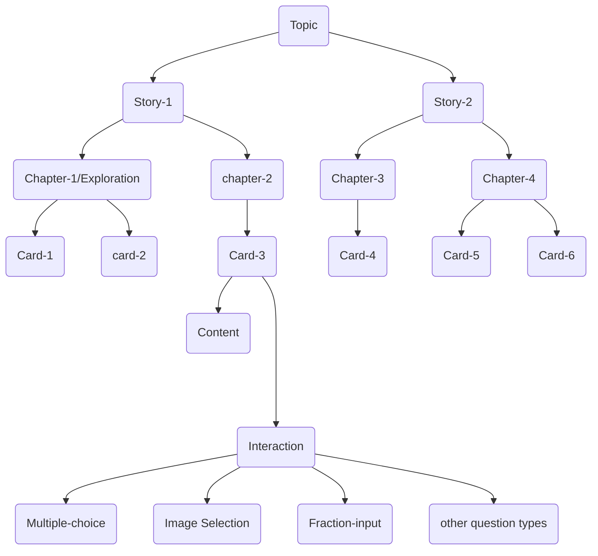

## Table of Contents

- [Overview of entities](#overview-of-entities)
- [Key terms](#key-terms)

## Overview of entities

This diagram outlines the various entities in Oppia and how they relate
to each other:

## Key terms

1. **Topic**: A topic is a broad term that refers to the subject content being taught (e.g. Addition/Subtraction). It appears on Home screen of app.
2. **Story**: Stories are situations/scenarios that are meant to help users understand the topic. For example, if the topic is addition, then one of the stories could be about where a kid goes to a shop and buys 3 pens and 4 pencils. A list of stories is shown in the "Lessons" tab when you open a topic from the home screen.
3. **Promoted Story**: Promoted Story is mainly the recent Story/Chapter you played. It is shown on the "home screen" with heading text "Stories For You".
4. **Skill**: This is a concrete learning outcome that describes something that a learner should be able to do. It is usually stated in the form “Given X, compute/calculate/draw/etc. Y.” For example: “Given a fraction, identify its numerator.”
5. **Exploration/Chapter**: This is a structured learning experience that is part of a story, and provides the learner with an active way to learn new concepts, as well as targeted feedback. It is the core unit of learning in Oppia. The flow/screens appears when any story is started is known as Exploration/Chapter.
6. **Concept Card**: This is a non-story-based explanation of how to perform a particular skill. It serves as a reference/reminder for students who may have encountered the skill before but forgotten how to carry it out. These can access from "Revision" tab or are linked within the chapter you are playing. 
7. **Question/QuestionPlayer**: This is a standalone question that may be used by students as part of a practice session.