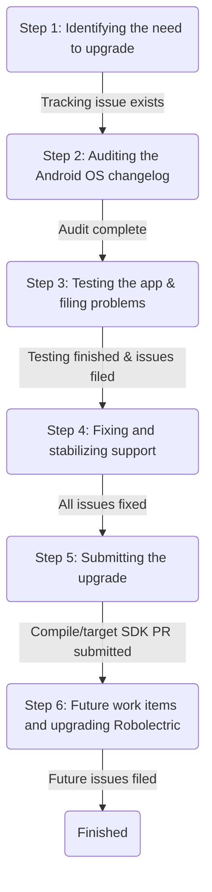

## Overview

Updating Oppia Android's [target SDK](https://developer.android.com/guide/topics/manifest/uses-sdk-element#target) provides an explicit signal to Android OS versions at or above the new target SDK level that the app should work correctly for that platform.

The target SDK version, unlike the compile SDK version, is specifically a runtime behavior signal. That means it enables functionality only observable by opening and running the app on the corresponding, or newer, versions of the OS. When Android makes changes that could break compatibility with older apps, they will usually gate this behind the target SDK level so that apps can have time to upgrade without users being unable to use them after they themselves upgrade to the newer Android version. Not every version of Android introduces these compatibility breakages, and not every potential breakage will affect Oppia Android.

This guide describes the high-level process for upgrading the app to a newer version of Android, and how to do it in a way that should reduce the risk of introducing breakages to users.

## Upgrade Process

### Step 1: Identifying the need to upgrade

There are generally three signals that may indicate the team should consider upgrading to a newer Android SDK target:
1. https://developer.android.com/google/play/requirements/target-sdk indicates an upgrade mandate and deadline. We also get this reminder via the Google Play Console.
2. A new version of Android has released to users and we perform a periodic check for compatibility (usually around July/August). We may decide to upgrade even if there isn't a mandate.
3. A feature requires a newer version of Android (note this is unlikely since we generally want to design features to work for all of our users).

If it's deemed that there's a new SDK version to target and the app isn't yet targeting it, a new feature request should be filed (similar to [#5535](https://github.com/oppia/oppia-android/pull/5535)) as long as there isn't an existing tracking issue for this work.

### Step 2: Auditing the Android OS changelog

All new Android OS functionality changes (both those tied to ``targetSdkVersion`` and those not) should be analyzed for potential areas of testing. These can be found on the Android developers site, for example for SDK 34:
- Changes affecting all apps: https://developer.android.com/about/versions/14/behavior-changes-all.
- Changes tied to changing target SDK version: https://developer.android.com/about/versions/14/behavior-changes-14.

Any concerning changes or functionality that could be beneficial to Oppia Android should be noted in the tracking issue for the SDK upgrade (see https://github.com/oppia/oppia-android/issues/5137#issuecomment-1815241974 for a good example of this).

#### Step 2.1: Tips for auditing
Note that narrowing down these categories isn't a process that can be easily described as a set of steps since new OS features may not even be predictable ahead of time. However, here are some tips that might help:
- Look for changes in permissions. This could either be an old permission that's now more restricted, or existing SDK functionality that's now blocked by a new permission (both have occurred in past Android OS updates). If the functionality and/or permission relates to Oppia Android, it should be noted. Note that some things may be tied to permissions and access control that's not obvious such as:
  - Filesystem management
  - Content providers (such as for photo selection which we use for users selecting their avatar)
  - Clipboard management (which we support for a specific user study feature)
- Look for changes in service/worker management, especially background processing (note that Oppia Android does not use a foreground service) and wakelocks. These areas receive updates in almost every OS version and Oppia Android relies in them indirectly (via Firebase and ``WorkManager``).
- Changes in SQLite database support _could_ affect the app, so it's worth noting.
- API deprecations should always be checked against the latest Oppia Android ``develop`` code and, in cases where we are using those APIs, be noted as this is likely to become a compiler error.
- Changes in media handling, especially for ``MediaPlayer``.
- Changes in UI lifecycle management (such as in a past OS version when Android introduced the support for multiple apps to be started, but not resumed, at the same time, e.g. for split screen).
- Generic changes that may affect any of the ~100 third-party dependencies the app uses. A good example of this: https://developer.android.com/about/versions/13/changes/non-sdk-13.

For anything else, if you're unsure whether it affects Oppia Android then err on the side of noting it rather than ignoring it. The expectation is that whoever goes through this step of the process will read _every_ listed change in the new target version of Android and note **everything** of interest.

#### Step 2.2: Reporting findings

Post the findings as a new comment in the tracking issue using three different lists:
1. One list for areas with known problems (e.g. API deprecations). Note that each of these problems should be filed as separate bugs in the Oppia Android issue tracker and their issue numbers noted as part of this list.
2. One list for areas that require additional verification to ensure compatibility.
3. One list for areas that could be of interest for future work.

The new comment should include an explicit indication of whether the audit was completed, or if additional analysis on Android SDK documentation is needed.

### Step 3: Testing the app & filing problems

Compatibility with the new target SDK should be done by:
1. Building a local production [Bazel build](https://github.com/oppia/oppia-android/wiki/Oppia-Bazel-Setup-Instructions#building-the-app) of the app (``//:oppia_beta``) and deployed to a local emulator or device running the **same** version of Android as the new target SDK version.
    - Note that this requires the local app's target SDK to be temporarily upgraded (see step (5) below) but not checked in.
    - In some cases, a real device may need to be used instead of an emulator since certain features change behavior on an emulator (such as the drag and drop interaction).
    - If the app isn't already using the new version of Android as its compile SDK version, then it may fail to build. Any build failures should be filed as issues on the issue tracker and fixed before this step of the process can continue.
2. Testing the app using the local production build of the app to ensure compatibility (see the following sub-sections for specifics).

#### Step 3.1: Testing potential problem areas

The list of focus areas to specifically test (per the audit completed in step (2) above) should be explicity tested to ensure that corresponding user features behave correctly and don't have new issues due to the SDK change.
- Note that in some cases this may require using both a handset and tablet emulator configuration if there are tablet-specific or layout-specific areas identified.
- Note that [#5137](https://github.com/oppia/oppia-android/issues/5137) may provide some good context on how to test certain types of changes that may not be as simple as manually performing a certain user action and may instead require a clever code change.

#### Step 3.2: Testing broad app behaviors

A general analysis should be peformed by testing the following scenarios:
- Profile creation/deletion and login.
- Playing, pausing, resuming, and finishing a lesson.
- Ensuring all interactions work (play through every test topic prototype exploration).
- Ensuring LaTeX and in-lesson images load correctly.
- Ensuring that lesson progress correctly saves per profile.
- Ensuring that profile avatars can be correctly set.
- Ensuring that hints and solutions work correctly.
- Ensuring that wrong answers are handled correctly.
- Checking that concept and revision cards work correctly.
- Verifying that events are logged (either per Firebase analytics if you have access, or the developer options menu using a build of ``//:oppia_dev``--note that ``oppia_dev`` should only be used for this specific verification and not any of the others).

#### Step 3.3: Cataloging findings

Any breakages should be noted, and then checked against a version of the app without the target SDK. From there:
- If the breakage still occurs, file a new bug noting the problem and mention in the 'additional context' section that it was found during target SDK testing but was determined as unrelated.
- If the breakage does not occur on the non-upgraded version of the app, file a new bug in the issue tracker and mention that it's specific to the new target SDK version and is a blocking issue.

Please note all found blocking issues with their issue numbers in a follow-up reply to the tracking issue. Any other thoughts or findings during testing can also be noted in the tracking issue (similar to the comments in [#5137](https://github.com/oppia/oppia-android/issues/5137)). Please also note in the tracking issue when testing has concluded.

### Step 4: Fixing and stabilizing support

Work on fixing all identified problems from steps (3) and (4) (either by directly fixing the problems via code changes, or via coordination with other members of the team).

Once all issues are fixed, verify each problem is correctly addressed using a temporary local build of the app (see step (3) above). If any problems are still occurring, reopen the corresponding tracking issue and leave a follow-up comment detailing the ongoing problem and steps to reproduce it.

Once all fixed issues are verified, leave a follow-up comment on the upgrade target SDK tracking issue mentioning that verification has concluded and there are no remaining issues found.

### Step 5: Submitting the upgrade

The actual code change to upgrade the app comes in two parts:
1. Upgrading the compile version (which may already be done as the team sometimes needs to update this for other reasons).
2. Upgrading the runtime target SDK version.

The sub-sections below detail each of the code changes needed to perform these upgrades.

**Important caveats and notes**:
- Both version upgrades can be done together in the same PR, but if they are split up the compile-time change (step (5.1) below) must happen first.
- [#5222](https://github.com/oppia/oppia-android/issues/5222) is an example of a PR that performs both steps in one, though it includes a few additional code changes that were needed as a result of the compile SDK change.
- Please note the CI results for this upgrade change. Any failures are likely problems that will need to be fixed within the upgrade PR (if small, e.g. the change in [#5222](https://github.com/oppia/oppia-android/issues/5222)) or filed as a separate bug that will need to be fixed before the upgrade can be submitted (see step (4) above).
- Updating the compile-time SDK version may require updating the build tools version. This is **not** a simple change and may cause difficult-to-fix breakages due to subtle compatibility issues between third-party dependencies and the build system configurations. If you suspect a build tools version upgrade is needed, please file an issue to track it and contact the developer workflow team lead to discuss next steps.
- Updating tests to use a newer version of Android can be exceptionally complicated, and thus this is considered a completely separate exercise from upgrading production code. See step (6) below for more specifics.

#### Step 5.1: Updating the compiled SDK version

This code change essentially requires replacing the old SDK version number (e.g. 31) with the new one (e.g. 33), but only for compile-time behaviors. All needed changes are detailed below:
1. [``.github/actions/set-up-android-bazel-build-environment/action.yml``](https://github.com/oppia/oppia-android/blob/dfb9a301280b9a46526cb2f5ca6329532fec6bf0/.github/actions/set-up-android-bazel-build-environment/action.yml#L75-L78) needs to be updated to install the correct SDK version (via the ``sdkmanager --install`` command).
2. Bazel [``build_vars.bzl``](https://github.com/oppia/oppia-android/blob/dfb9a301280b9a46526cb2f5ca6329532fec6bf0/build_vars.bzl#L1) changes to ``BUILD_SDK_VERSION``.
3. Gradle ``compileSdkVersion`` changes (e.g. for [``app/build.gradle``](https://github.com/oppia/oppia-android/blob/dfb9a301280b9a46526cb2f5ca6329532fec6bf0/app/build.gradle#L8)). Note that all module ``.gradle`` files will need to be updated in this way.

#### Step 5.2: Updating the target SDK version

This code change requires changing Bazel, Gradle, and ``AndroidManifest.xml`` files. All needed changes are detailed below:
1. The top-level [``BUILD.bazel``](https://github.com/oppia/oppia-android/blob/dfb9a301280b9a46526cb2f5ca6329532fec6bf0/BUILD.bazel#L118-L130)'s APK targets need to be upgraded to target the correct SDK.
2. All Bazel AAB targets need to be updated in [``build_flavors.bzl``](https://github.com/oppia/oppia-android/blob/dfb9a301280b9a46526cb2f5ca6329532fec6bf0/build_flavors.bzl#L45-L146)'s ``_FLAVOR_METADATA`` dict to point to the correct target SDK version (each flavor has its own target SDK declared).
3. All manifest XML files (e.g. [``app/src/main/AppAndroidManifest.xml``](https://github.com/oppia/oppia-android/blob/dfb9a301280b9a46526cb2f5ca6329532fec6bf0/app/src/main/AppAndroidManifest.xml#L4)) that _have_ an ``android:targetSdkVersion`` attribute need to be updated to use the correct version. If a manifest file is missing this attribute, it doesn't need to be changed.
4. All module ``.gradle`` files must be updated to use the correct target SDK version, e.g. [``app/build.gradle``](https://github.com/oppia/oppia-android/blob/dfb9a301280b9a46526cb2f5ca6329532fec6bf0/app/build.gradle#L13).

After the four areas above are completed, the old SDK version is unlikely to be present anywhere in the codebase. This can be verified using a quick "find all" or ``grep`` search. One likely exception is tests (see the caveats list in the main section of step (5) above).

The PR that updates the target SDK version can be marked as fixing and closing the corresponding tracking issue.

### Step 6: Future work items and upgrading Robolectric

Findings from the analysis in step (2) should be considered as potential future work items. Anything that either the CLaM or developer workflow team leads think might be worth pursuing in the future should be filed as feature requests in the issue tracker and mentioned in a follow-up comment in the SDK upgrade tracking issue.

Ideally, Robolectric tests would also be upgraded with the target SDK version. However, there are a few problems with this currently:
1. Robolectric's version is tightly coupled with the SDKs it supports (since Robolectric itself needs to be updated to support each version of Android).
2. Robolectric usually lags far behind (sometimes more than a year) mainline Android for SDK support.
3. Upgrading Robolectric can have significant downstream effects. One such case that's been observed in the past:
    - Upgrading Robolectric required upgrading Espresso (since Robolectric depends on Espresso libraries to implement part of its API).
    - Upgrading Espresso required upgrading AndroidX libraries (which actually impact production behaviors).
    - Upgrading the AndroidX libraries led to many other version upgrades that actually eventually led to a Kotlin version upgrade and an upgrade to the version of Bazel used.
4. Robolectric does not have strong behavior consistency between SDK versions so tests have a relatively higher chance of regressing when changing the SDK version Robolectric is using by default than production code.

For now, the best course of action is to either file a new feature request to upgrade Robolectric tests to use the same target SDK as the app by default, or update the existing issue if there's one already tracking an upgrade (which is likely since the upgrade can be both difficult and time consuming, so it's usually not a team priority).
