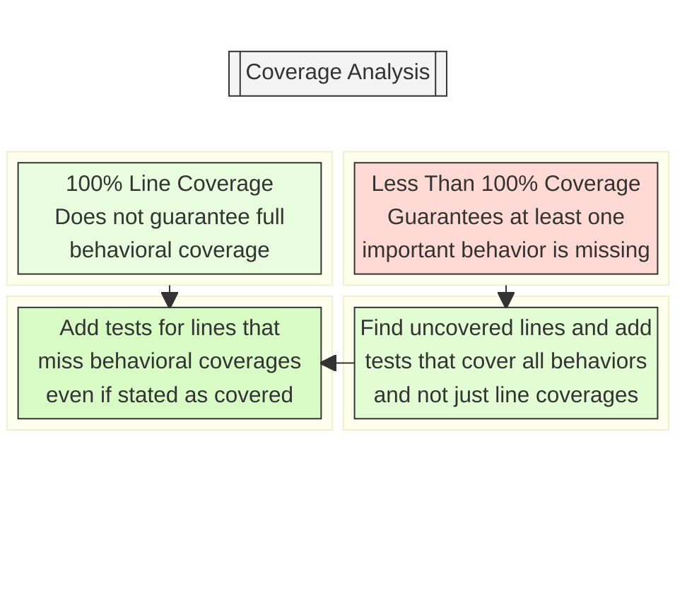
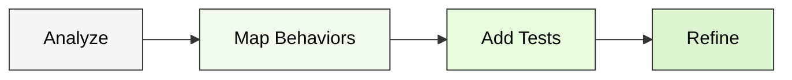
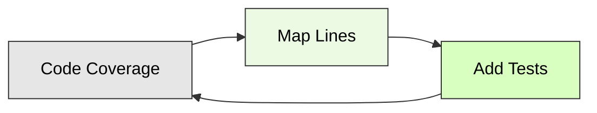
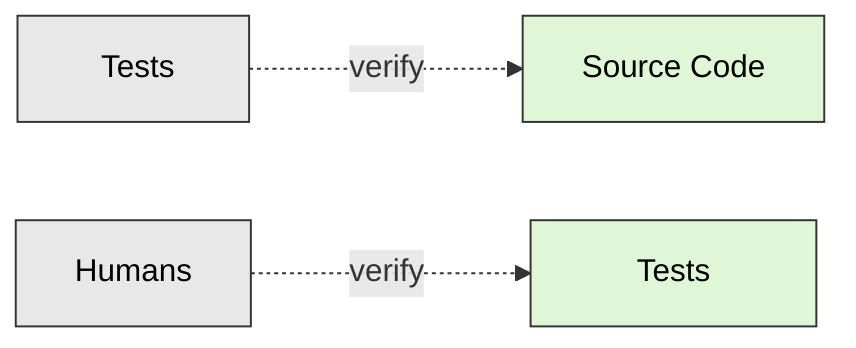
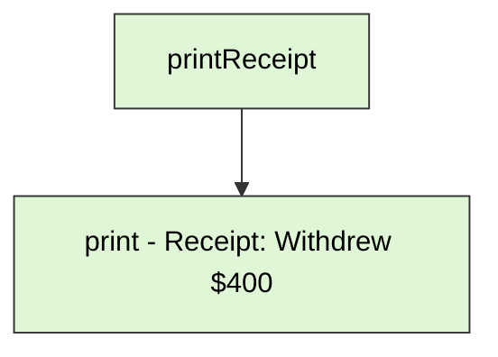
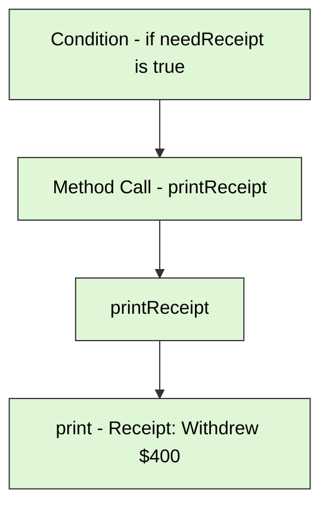
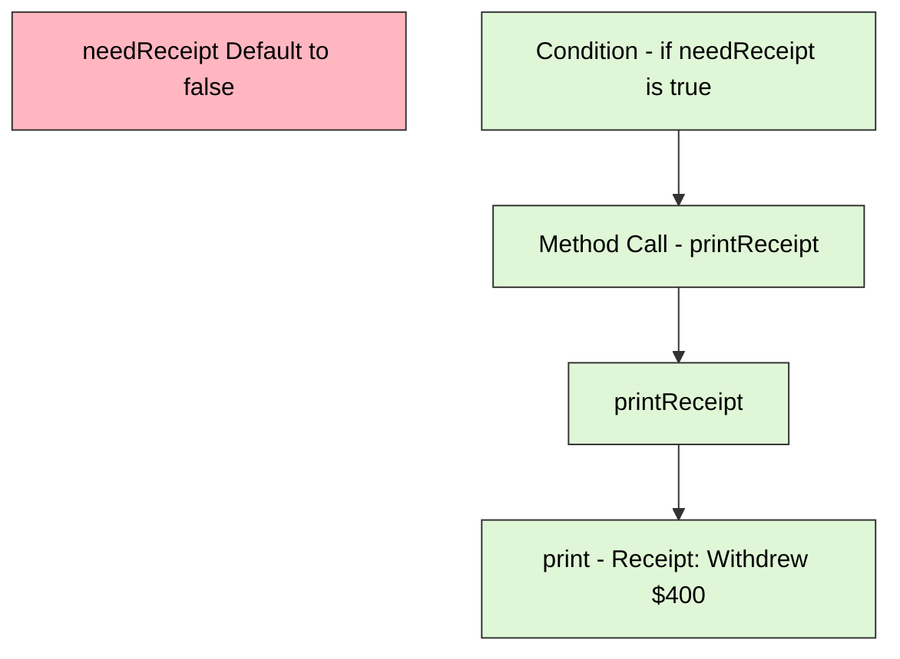
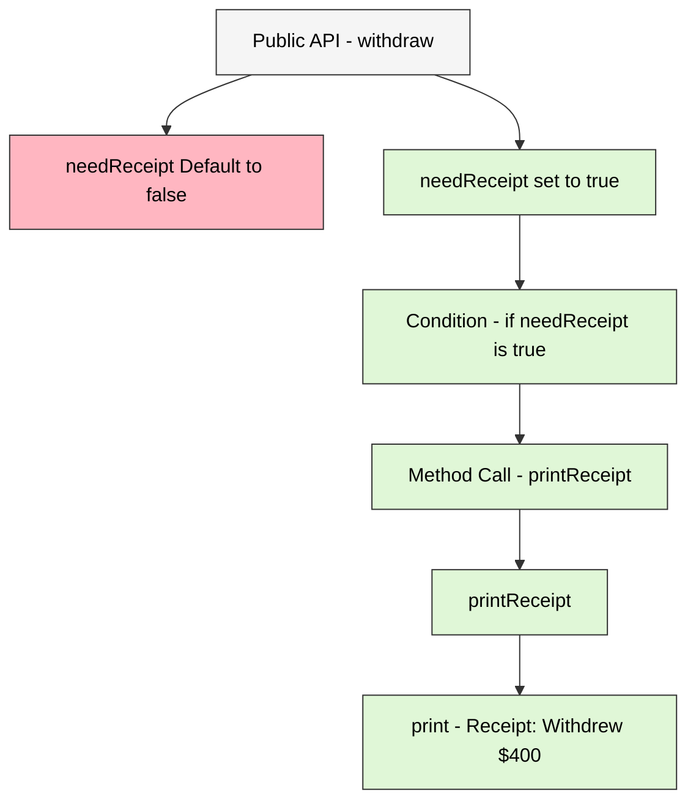

## Table of Contents

- [What is Behavioral Coverage?](#what-is-behavioral-coverage)
- [Understanding Behavioral Coverage and its Importance](#understanding-behavioral-coverage-and-its-importance)
- [Writing Effective Tests](#writing-effective-tests)
  - [1. Understanding the Requirements](#1-understanding-the-requirements)
  - [2. Writing Clear and Descriptive Test Cases](#2-writing-clear-and-descriptive-test-cases)
  - [3. Focusing on Specific Test Cases](#3-focusing-on-specific-test-cases)
  - [4. Covering Different Scenarios](#4-covering-different-scenarios)
  - [5. Covering All Branches, Paths, and Conditions](#5-covering-all-branches-paths-and-conditions)
  - [6. Exception and Error Handling](#6-exception-and-error-handling)
  - [7. Absence of Unwanted Output](#7-absence-of-unwanted-output)
- [Testing Public APIs](#testing-public-apis)
- [Structuring Test Bodies](#structuring-test-bodies)
  - [1. When and How to Divide Responsibilities](#1-when-and-how-to-divide-responsibilities)
  - [2. When Not to Divide Responsibilities](#2-when-not-to-divide-responsibilities)
  - [3. Importance of Descriptive Test Names](#3-importance-of-descriptive-test-names)
- [How to Map a Line of Code to Its Corresponding Behaviors?](#how-to-map-a-line-of-code-to-its-corresponding-behaviors)

# What is Behavioral Coverage?

Behavioral coverage refers to the practice of testing various behaviors or functional aspects of your code to ensure it operates correctly under different scenarios. Instead of merely executing lines of code, it focuses on validating that all specified behaviors, edge cases, and conditions are correctly handled by the code.

## Understanding Behavioral Coverage and its Importance

Focusing on behavioral coverage is essential because:

- Multiple Behaviors per Line: A single line of code can produce multiple behaviors depending on input values and conditions.
- Comprehensive Testing: High line coverage doesn’t guarantee all behaviors are tested. Behavioral coverage ensures every scenario, including edge cases and exceptions, is validated.
- Quality Over Quantity: Achieving high line coverage might give a false sense of security. Testing all possible behaviors ensures higher quality and robustness.

Let's understand it better with a sample function. Consider this function that validates a name:

```kotlin
fun getName(name: String? = " ") =
  name?.takeIf { it.all { char -> char.isLetterOrWhitespace() } }
    ?: throw IllegalArgumentException("Invalid name")
```

### Line Coverage Testing

A basic test case for line coverage might look like this:

```kotlin
@Test 
fun testValidName() {
  // Tests line coverage by hitting the line where name is accessed
  assertThat(getName("Alice")).isEqualTo("Alice") 
}
```

**Line Coverage Result:** This test covers the line of code but doesn’t test all scenarios.

### Behavioral Coverage Testing

To ensure behavioral coverage, the test needs to verify various conditions:

```kotlin
@Test 
fun testGetName_withDefaultValue_returnsEmptyValue() {
  // Default value when no name is provided
  assertThat(getName()).isEmpty()
}

@Test 
fun testGetName_withNullName_throwsException() {
  // Exception for null value
  assertThrows<IllegalArgumentException> { getName(null) } 
}

@Test 
fun testGetName_withSpecialCharacters_throwsException() {
  // Exception for special characters
  assertThrows<IllegalArgumentException> { getName("!@#$%^&*()") } 
}

@Test 
fun testGetName_withEmptyName_returnsEmptyValue() {
  // Empty string should use default value
  assertThat(getName("")).isEmpty()
}

@Test 
fun testGetName_withWhitespaceName_returnsWhitespaceValue() {
  // Whitespace name
  assertThat(getName("   ")).isEqualTo("   ")
}
```

**Behavioral Coverage Result:** These tests ensure that all potential behaviors, including edge cases and exceptions, are covered, providing a more thorough validation.

### Quality > Percentage

While line coverage might reach 100% with a single test, it doesn’t ensure that all scenarios are tested. Behavioral coverage ensures quality by validating all possible scenarios and edge cases, which is more important for reliable software.

**Evaluation and Enhancement Flow:**



**Coverage and Behavior:**

- 100% Line Coverage: Does not guarantee that all critical behaviors and edge cases are tested. It merely shows that each line of code has been executed.
- Less Than 100% Coverage: Guarantees that some part of the code is not covered by tests, which likely means that at least one important behavior or edge case is missing from the tests.

**Line Coverage as a Starting Point:**

- Use line coverage metrics as a starting point to identify which parts of the code have not been tested.
- Analyze these uncovered lines to determine which behaviors are associated with them. While line coverage helps locate untested code, it is crucial to ensure that all significant behaviors are tested, especially for volatile or complex scenarios.

**Improving Coverage:**

- Testing a specific line of code is useful, but it’s equally important to check for other missing behaviors or edge cases even if a line is stated as covered with coverage analysis.
- If a line of code is covered but does not account for all potential scenarios, add tests to cover those additional important behaviors.
- Ensure that tests are comprehensive by addressing various scenarios, including edge cases and error conditions, which might not be immediately obvious from line coverage alone.

For more details on testing methodologies specific to Oppia Android, please refer to the [Oppia Android Testing](https://github.com/oppia/oppia-android/wiki/Oppia-Android-Testing).

# Writing Effective Tests

Writing effective tests is crucial for ensuring that your code behaves correctly under various conditions. Good testing practices help you identify issues early, maintain high code quality, and ensure that changes or new features do not break existing functionality. This guide focuses on how to write tests that not only check if your code runs but also verify that it performs as expected in different scenarios.

## 1. Understanding the Requirements

Before you start writing tests, it's essential to thoroughly understand the requirements or specifications for the functionality you are testing. This ensures that your tests accurately reflect what the code is supposed to do.

#

**Example User Story and Specification:**

| **Aspect**               | **Details**                                   |
|--------------------------|-----------------------------------------------|
| **User Story**           | As a shopper, I want to check if an item’s price is within my budget. If the price is above my budget, I shouldn’t buy it. If it’s within my budget, I should buy it. |
| **Function Name**        | `shouldBuyItem`                               |
| **Inputs**               | - `price`: A double representing the item's price.<br>- `budget`: A double representing the maximum amount you’re willing to spend. |
| **Output**              | A boolean indicating whether the item should be bought. |
| **Behavior**            | - Return `true` if the price is less than or equal to the budget.<br>- Return `false` if the price is greater than the budget. |

**Requested Feature Code:**

The function to determine if an item should be bought based on the price and budget is,

```kotlin
fun shouldBuyItem(price: Double, budget: Double): Boolean {
  return price <= budget
}
```

**Respective Test Case:**

To ensure that the shouldBuyItem function works correctly, we can add the following test cases,

```kotlin
@Test
fun testShouldBuyItem_withPriceWithinBudget_returnsTrue() {
  assertThat(shouldBuyItem(50.0, 100.0)).isTrue()
}

@Test
fun testShouldBuyItem_withPriceAboveBudget_returnsFalse() {
  assertThat(shouldBuyItem(150.0, 100.0)).isFalse()
}
```

## 2. Writing Clear and Descriptive Test Cases

Each test case should:

- Clearly describe the scenario and expected outcome.
- Use descriptive names for your test methods.

Naming Convention:
```kotlin
testAction_withOneCondition_withSecondCondition_hasExpectedOutcome
```

Example:
```kotlin
testCheckSign_forPositiveInput_returnsPositive()
testCheckSign_forNegativeInput_returnsNegative()
testCheckSign_forZeroInput_returnsNeitherPositiveNorNegative()
```

## 3. Focusing on Specific Test Cases

When testing a function that performs multiple actions, it's crucial to write test cases that focus on individual aspects of the function. This approach allows you to isolate and identify issues more effectively if a test fails, rather than dealing with a more complex failure analysis.

### Why Focus on Specific Test Cases?
Testing one thing at a time helps:

- Identify Issues More Easily: If a test fails, you know precisely which aspect of the function is problematic.
- Improve Test Clarity: Each test case has a clear purpose, making tests easier to read and maintain.
- Isolate Failures: Helps in pinpointing issues related to a specific behavior or output.

Consider a function that manages a food order process. This function does the following:

1. Lists the food items.
2. Calculates the total price.
3. Displays the order.
4. Checks if the payment has been made and provides the corresponding message.

```kotlin
fun processOrder(order: List<String>, paymentMade: Boolean): String {
  // List the food items
  val itemList = order.joinToString(", ")
    
  // Calculate total price (mocked here for simplicity)
  val totalPrice = order.size * 10.0
    
  // Display order
  println("Order: $itemList")
  println("Total: $totalPrice")
    
  // Payment status
  return if (paymentMade) "Payment successful" else "Payment pending"
}
```

**Potential output with payment made:**

```
Order: Pizza, Burger
Total: 20.0
Result: Payment successful
```

### Testing the Entire Functionality

**Single Test Case:**

```kotlin
@Test
fun testProcessOrder_allSteps_returnsCorrectMessage() {
  val result = processOrder(listOf("Pizza", "Burger"), paymentMade = true)
  assertThat(result).isEqualTo("Payment successful")
}
```

**Difficulties in Testing All Aspects Together:**

- Complex Failure Diagnosis: If this test fails, you need to diagnose whether the issue lies in listing items, calculating the total, displaying the order, or payment status.
- Less Focused: It does not target individual aspects of the function, making it harder to identify which specific action failed for cases when the test overall is failing.

### Testing Specific Aspects

**Test Case 1: Testing Listing items**

```kotlin
@Test
fun testProcessOrder_providedWithList_displaysListOfItems() {
  processOrder(listOf("Pizza", "Burger"), paymentMade = true)
  val output = outContent.toString().trim()
  assertThat(output).contains("Order: Pizza, Burger")
}
```

**Test Case 2: Calculates Total**

```kotlin
@Test
fun testProcessOrder_forListItems_calculatesCorrectTotalPrice() {
  processOrder(listOf("Pizza", "Burger"), paymentMade = true)
  val output = outContent.toString().trim()
  assertThat(output).contains("Total: 20.0")
}
```

**Test Case 3: Payment Success**

```kotlin
@Test
fun testProcessOrder_whenPaymentMade_displaysPaymentSuccess() {
  processOrder(listOf("Pizza", "Burger"), paymentMade = true)
  val output = outContent.toString().trim()
  assertThat(output).contains("Payment successful")
}
```

**Test Case 4: Payment Pending**

```kotlin
@Test
fun testProcessOrder_whenNotPaymentMade_displaysPaymentPending() {
  processOrder(listOf("Pizza", "Burger"), paymentMade = false)
  val output = outContent.toString().trim()
  assertThat(output).contains("Payment pending")
}
```

**Benefits of specific test cases:**

- Clear Purpose: Each test case has a single, well-defined objective, making the tests more readable and maintainable.
- Easier Debugging: Focusing on one aspect makes it easier to pinpoint and fix issues.
- Improved Coverage: Ensures that each individual functionality of the method is tested thoroughly.

## 4. Covering Different Scenarios

To ensure robust testing, it's crucial to cover various scenarios your function might encounter. This involves testing the function with a range of inputs, including positive numbers, negative numbers, zero, and edge cases. Each scenario should be tested to verify that your function behaves correctly across different conditions.

Consider a function `checkSign` that takes an integer and returns a string indicating whether the number is positive, negative, or zero.

```kotlin
fun checkSign(number: Int): String {
  return when {
    number > 0 -> "Positive"
    number < 0 -> "Negative"
    else -> "Zero"
  }
}
```

### Testing different scenerios

Positive Number: Verifies that the function correctly identifies positive numbers.

```kotlin
@Test
fun testCheckNumber_forPositiveInput_returnsPositive() {
  assertThat(checkNumber(5)).isEqualTo("Positive")
}
```

Negative Number: Ensures that negative numbers are correctly classified.

```kotlin
@Test
fun testCheckNumber_forNegativeInput_returnsNegative() {
  assertThat(checkNumber(-3)).isEqualTo("Negative")
}
```

Zero: Checks that zero is handled correctly.

```kotlin
@Test
fun testCheckNumber_forZeroInput_returnsZero() {
  assertThat(checkNumber(0)).isEqualTo("Zero")
}
```

Maximum Value: Tests the function with Int.MAX_VALUE to ensure it handles the upper boundary.

```kotlin
@Test
fun testCheckNumber_forMaxValue_returnsPositive() {
  assertThat(checkNumber(Int.MAX_VALUE)).isEqualTo("Positive")
}
```

Minimum Value: Tests the function with Int.MIN_VALUE to ensure it handles the lower boundary.

```kotlin
@Test
fun testCheckNumber_forMinValue_returnsNegative() {
  assertThat(checkNumber(Int.MIN_VALUE)).isEqualTo("Negative")
}
```

## 5. Covering All Branches, Paths, and Conditions

Testing all branches, paths, and conditions within your code is essential to ensure that every possible execution path is verified. This approach helps in identifying edge cases and logic errors that could otherwise go unnoticed. Effective testing covers all possible scenarios, including combinations of conditions and branching logic.

Let's see the function to evaluate a user's access level based on their age and membership status.

```kotlin
fun evaluateAccess(age: Int, isMember: Boolean): String {
  var result: String

  if (age >= 18 && isMember) {
    result = "Access granted"
  } else if (age >= 18 && !isMember) {
    result = "Membership required"
  } else {
    result = "Access denied"
  }

  return result
}
```

The different scenarios and the expected outcomes are,

| Scenario         | Description                           | Expected Outcome           |
|------------------|---------------------------------------|----------------------------|
| Adult Member     | `age >= 18` and `isMember = true`     | Returns "Access granted"   |
| Adult Non-Member | `age >= 18` and `isMember = false`    | Returns "Membership required" |
| Minor Member     | `age < 18` and `isMember = true`      | Returns "Access denied"    |
| Minor Non-Member | `age < 18` and `isMember = false`     | Returns "Access denied"    |

Testing needs to be performed to cover all branches, paths and conditions.

```kotlin
@Test
fun testEvaluateAccess_forAdultMember_grantsAccess() {
  assertThat(evaluateAccess(25, true)).isEqualTo("Access granted")
}

@Test
fun testEvaluateAccess_forAdultNonMember_requiresMembership() {
  assertThat(evaluateAccess(30, false)).isEqualTo("Membership required")
}

@Test
fun testEvaluateAccess_forMinorMember_deniesAccess() {
  assertThat(evaluateAccess(16, true)).isEqualTo("Access denied")
}

@Test
fun testEvaluateAccess_forminorNonMember_deniesAccess() {
  assertThat(evaluateAccess(15, false)).isEqualTo("Access denied")
}
```

Testing all branches and conditions ensures that your function can handle all possible scenarios, making it more reliable and easier to maintain.

## 6. Exception and Error Handling

### Exceptions

Exceptions are unexpected events or errors that occur during the execution of a program, disrupting the normal flow of instructions. These are typically conditions that a program cannot anticipate or recover from easily, such as a division by zero, accessing an invalid index in an array, or trying to open a file that doesn’t exist. When an exception occurs, the program may terminate abruptly unless the exception is properly handled.

```kotlin
fun divideNumbers(numerator: Int, denominator: Int): Int {
  if (denominator == 0) throw IllegalArgumentException("Denominator cannot be zero")
  return numerator / denominator
}
```

In this example, if the denominator is zero, an `IllegalArgumentException` is thrown. This is a standard way to handle situations where continuing the program as usual doesn’t make sense due to an error in the input.

**Testing Exceptions:**

The primary focus when testing exceptions is ensuring that the correct exception is thrown in the appropriate circumstances and that the program can handle it gracefully.

**Test:**

```kotlin
@Test
fun testDivideNumbers_forZeroDenominator_throwsIllegalArgumentException() {
  val exception = assertThrows<IllegalArgumentException> {
    divideNumbers(10, 0)
  }
  assertThat(exception).hasMessageThat().contains("Denominator cannot be zero")
}
```

This test verifies that the divideNumbers function throws an IllegalArgumentException when the denominator is zero. It also checks that the exception message contains the expected text. Testing exceptions involves confirming that the application correctly identifies and handles these unexpected situations.

### Domain Errors

Domain errors are errors related to the logic or rules of the application, rather than technical issues like those covered by exceptions. These errors occur when the data or conditions within the domain do not meet the specific rules or constraints defined during application design. Domain errors are expected conditions and are handled within the normal flow of the application, rather than through exceptions.

Let's understand this with a sample snippet from the source **[FractionParser.kt](https://github.com/oppia/oppia-android/blob/f9106d91297abd09b24da25d5485deb8473b0125/utility/src/main/java/org/oppia/android/util/math/FractionParser.kt#L7)**

```kotlin
fun getSubmitTimeError(text: String): FractionParsingError {
  if (text.isNullOrBlank()) {
    return FractionParsingError.EMPTY_INPUT
  }
  if (invalidCharsLengthRegex.find(text) != null) {
    return FractionParsingError.NUMBER_TOO_LONG
  }
  if (text.endsWith("/")) {
    return FractionParsingError.INVALID_FORMAT
  }
  val fraction = parseFraction(text)
  return when {
    fraction == null -> FractionParsingError.INVALID_FORMAT
    fraction.denominator == 0 -> FractionParsingError.DIVISION_BY_ZERO
    else -> FractionParsingError.VALID
  }
}
```

This function checks various conditions on the input string text to determine whether it meets the criteria for a valid fraction. Each condition that fails returns a specific domain error from the FractionParsingError enum. Unlike exceptions, these errors are expected as part of the application's logic and represent specific, recoverable conditions that the application can handle.

**Testing Domain Errors:**

The goal when testing domain errors is to ensure that the application correctly identifies and responds to these errors as part of its normal operation.

**Test samples from [FractionParserTest.kt](https://github.com/oppia/oppia-android/blob/f9106d91297abd09b24da25d5485deb8473b0125/utility/src/test/java/org/oppia/android/util/math/FractionParserTest.kt#L19):**

```kotlin
@Test
fun testSubmitTimeError_tenDigitNumber_returnsNumberTooLong() {
  val error = getSubmitTimeError("0123456789")
  assertThat(error).isEqualTo(FractionParsingError.NUMBER_TOO_LONG)
}

@Test
fun testSubmitTimeError_nonDigits_returnsInvalidFormat() {
  val error = getSubmitTimeError("jdhfc")
  assertThat(error).isEqualTo(FractionParsingError.INVALID_FORMAT)
}

@Test
fun testSubmitTimeError_divisionByZero_returnsDivisionByZero() {
  val error = getSubmitTimeError("123/0")
  assertThat(error).isEqualTo(FractionParsingError.DIVISION_BY_ZERO)
}

@Test
fun testSubmitTimeError_ambiguousSpacing_returnsInvalidFormat() {
  val error = getSubmitTimeError("1 2 3/4")
  assertThat(error).isEqualTo(FractionParsingError.INVALID_FORMAT)
}
```

These tests check various inputs to ensure the getSubmitTimeError function correctly identifies and returns the appropriate FractionParsingError. Each test case focuses on a specific condition that is expected and handled within the domain logic, ensuring the application behaves as intended.

### Handling Exceptions and Domain Errors

- **Nature:** Exceptions are typically unforeseen disruptions in program execution, whereas domain errors are expected results of business logic conditions.

- **Focus:** When testing exceptions, the focus is on ensuring proper handling and recovery from unexpected situations. In contrast, testing domain errors involves verifying that the application correctly identifies and manages these expected conditions.

- **Handling and Recovery:** Exceptions often require special recovery mechanisms, such as try-catch blocks, while domain errors are managed through normal application logic and flow control.

## Key Considerations for Testing Exception / Error Scenarios

Testing exceptions and error handling is vital to ensure that applications behave correctly under error conditions, provide meaningful feedback, and maintain reliability. Without these tests, applications are prone to unpredictable failures, poor user experiences, and potential security issues.

### 1. Verifying Correct Exception Types

Ensure that the correct type of exception is thrown in response to error conditions. This confirms that your error handling logic is specific and accurate.

```kotlin
@Test
fun testDivideNumbers_forZeroDenominator_throwsIllegalArgumentException() {
  assertThrows<IllegalArgumentException> {
    divideNumbers(10, 0)
  }
}
```

### 2. Checking for Proper Exception Messages

When writing tests, it's crucial to ensure that exceptions thrown by your code contain meaningful and descriptive messages. These messages play a vital role in diagnosing issues, providing clarity on what went wrong and why it happened.

Let's consider a TicketBooking class that has a function to reserve a seat. This function checks if seats are available using Kotlin's check() function. If no seats are available, it throws an exception with a specific message.

**Functionality:**

```kotlin
class TicketBooking {
  fun reserveSeat(seatsAvailable: Int) {
    check(seatsAvailable > 0) {
      "No seats are available. Please check other bookings for available seats."
    }
    // Additional code to reserve a seat
  }
}
```

In this case, when the **seatsAvailable** becomes 0, the `check()` function will throw an `IllegalStateException` with the message "No seats are available. Please check other bookings for available seats."

**Test:**

To verify that the exception is thrown with the correct message, we write a test case:

```kotlin
@Test
fun testBookTickets_withUnavailableSeats_throwsException() {
  val booking = TicketBooking()
  val exception = assertThrows<IllegalStateException> {
    booking.reserveSeat(0)
  }
  assertThat(exception).hasMessageThat().contains("No seats are available. Please check other bookings for available seats.")
}
```

This test case checks that when no seats are available, the reserveSeat() function throws an `IllegalStateException` with the appropriate message.

### Why verify Exception Messages?

Verifying exception messages is crucial for ensuring the correctness and usefulness of your tests. This is especially important when dealing with generic exceptions, where multiple checks might throw the same type of exception.

To better understand this, let's extend the `TicketBooking` class with an additional function that checks the payment status before confirming a booking. This function uses `check()` to verify if the payment was successful. If not, it throws an exception with a specific message.

**Extended Functionality:**

```kotlin
class TicketBooking {
  fun reserveSeat(seatsAvailable: Int) {
    check(seatsAvailable > 0) {
      "No seats are available. Please check other bookings for available seats."
    }
    // Additional code to reserve a seat
  }

  fun confirmPayment(isPaymentSuccessful: Boolean) {
    check(isPaymentSuccessful) {
      "Payment not successful. Please try again."
    }
    // Additional code to confirm payment
  }
}
```

In this scenario, the `confirmPayment()` function throws an `IllegalStateException` if the payment is not successful, with the message "Payment not successful. Please try again."

### Importance of Specific Error Messages

Imagine if both checks in the `reserveSeat()` and `confirmPayment()` functions used generic messages like "Error occured" as:

```kotlin
check(seatsAvailable > 0) { "Error occurred" }
check(isPaymentSuccessful) { "Error occurred" }
```

In this case, when an exception is thrown, it becomes very challenging to determine the exact cause of the error. Did the error occur because there were no seats available, or because the payment was not successful? This ambiguity can make debugging difficult and reduce the effectiveness of your tests.

That is why it is necessary to test that each exception throws a specific error message relevant to its particular scenario—to help accurately diagnose where things went wrong. Consider the following test cases:

**Test for Seat Availability:**

```kotlin
@Test
fun testBookTickets_withUnavailableSeats_throwsException() {
  val booking = TicketBooking()
  val exception = assertThrows<IllegalStateException> {
    booking.reserveSeat(0)
  }
  assertThat(exception).hasMessageThat().contains("No seats are available. Please check other bookings for available seats.")
}
```

This test case ensures that when no seats are available, the correct exception with the appropriate message is thrown.

**Test for Payment Status:**

```kotlin
@Test
fun testConfirmPayment_withUnsuccessfulPayment_throwsException() {
  val booking = TicketBooking()
  val exception = assertThrows<IllegalStateException> {
    booking.confirmPayment(false)
  }
  assertThat(exception).hasMessageThat().contains("Payment not successful. Please try again.")
}

```

### 3. Ensuring Exceptions Are Thrown at Correct Times

Exceptions should be thrown only under specific conditions, not during normal operations. Verify that exceptions are correctly managed according to the context.

```kotlin
@Test
fun testDivideNumbers_forValidInputs_returnsExpectedResult() {
  val result = divideNumbers(10, 2)
  assertThat(result).isEqualTo(5)
}
```

### 4. Testing Edge Cases

Test edge cases where exceptions might be thrown, such as boundary values or extreme input scenarios.

**Function with Edge Case Handling:**

```kotlin
fun calculateDiscount(price: Double, discountPercent: Double): Double {
  if (price < 0 || discountPercent < 0) { 
    throw IllegalArgumentException("Price and discount cannot be negative")
  }
  return price - (price * discountPercent / 100)
}
```

**Test Case:**

```kotlin
@Test
fun testCalculateDiscount_forNegativePrice_throwsIllegalArgumentException() {
  val exception = assertThrows<IllegalArgumentException> {
    calculateDiscount(-100.0, 10.0)
  }
  assertThat(exception).hasMessageThat().contains("Price and discount cannot be negative")
}

@Test
fun testCalculateDiscount_forNegativeDiscount_throwsIllegalArgumentException() {
  val exception = assertThrows<IllegalArgumentException> {
    calculateDiscount(100.0, -10.0)
  }
  assertThat(exception).hasMessageThat().contains("Price and discount cannot be negative")
}
```

## 7. Absence of Unwanted Output

In addition to validating correct handling of valid and invalid files, it's also important to ensure that unwanted output or behavior does not occur.

Let's use a simple `Pizza` class with an `orderPizza` function that has optional parameters like **addCheese** and **takeaway**. The idea is to test that when these options are set to **false**, no corresponding messages are printed.

**Functionality:**

```kotlin
class Pizza {
  fun orderPizza(addCheese: Boolean = false, takeaway: Boolean = false): String {
    var orderDetails = "Ordered a pizza"
        
    if (addCheese) {
      orderDetails += " with extra cheese"
    }
        
    if (takeaway) {
      orderDetails += " for takeaway"
    }

    println(orderDetails)
    return orderDetails
  }
}
```

**Test:**

Ensure No Cheese Message When **addCheese** is **false**

```kotlin
@Test
fun testOrderPizza_withNoCheese_doesNotPrintCheeseMessage() {
  val pizza = Pizza()
  val output = ByteArrayOutputStream()
  System.setOut(PrintStream(output))

  // Order pizza without cheese, default value is false
  pizza.orderPizza(addCheese = false)

  // Verify that "with extra cheese" is not printed
  assertThat(output.toString().trim()).doesNotContain("with extra cheese")

  System.setOut(System.out)
}
```

**Test:**

Ensure No Takeaway Message When **takeaway** is **false**

```kotlin
@Test
fun testOrderPizza_withNoTakeaway_doesNotPrintTakeawayMessage() {
  val pizza = Pizza()
  val output = ByteArrayOutputStream()
  System.setOut(PrintStream(output))

  // Order pizza without takeaway, default value is false
  pizza.orderPizza(takeaway = false)

  // Verify that "with extra cheese" is not printed
  assertThat(output.toString().trim()).doesNotContain("for takeaway")

  System.setOut(System.out)
}
```

These tests confirm that the class behaves as expected without producing unnecessary outputs.

# Testing Public APIs

A public API (Application Programming Interface) refers to the set of methods, properties, and functionalities exposed by a class or module for use by external code. It defines how other parts of a system or external systems can interact with the functionality provided by that class or module.

Public APIs are essential because they provide a way to interact with the functionality of a class or module without exposing its internal workings. They define how external code can use the functionality offered by the class or module, ensuring that interactions are safe and predictable while keeping the internal implementation hidden and secure.

Let's consider the following example for a public API to withdraw money from a BankAccount.

```kotlin
class BankAccount(
  private var balance: Double, 
  private val username: String, 
  private val password: String 
) {

  // Public method to withdraw money
  fun withdraw(
    requestedUsername: String, // Username provided for the withdrawal
    requestedPassword: String, // Password provided for the withdrawal
    file: File? = null // Optional passbook file to upload to note transactions
    amount: Double, // Amount to withdraw
    needReceipt: Boolean = false // Flag to indicate if a receipt is needed, defaults to false
  ) {
    // Verify user credentials
    // Validate withdrawal amount
    // Perform the withdrawal operation
    // Print a receipt if needed
    println("Withdrawing $amount for $requestedUsername")
    if (needReceipt) {
      printReceipt(amount)
    }

    // Process the file if provided
    file?.let {
      processFile(it)
    }
  }

  private fun isValidUser(requestedUsername: String, requestedPassword: String): Boolean {
    return true
  }

  private fun isValidWithdrawal(amount: Double): Boolean {
    return true
  }

  private fun performWithdrawal(amount: Double) {
    println("Withdrew $amount. New balance is $balance")
  }

  private fun printReceipt(amount: Double) {
    println("Receipt: Withdrew $amount. Current balance: $balance")
  }

  private fun processFile(file: File) {
    println("Processing file: ${file.name}")
  }
}
```

The **`withdraw`** method serves as the single public entry point for withdrawing money from the account. It handles user validation, amount checking, optional file upload and printing of the receipt. By keeping the internal methods private, the class ensures that the operations are performed in a controlled manner while hiding the complexity of these operations from the user.

## How to Write Tests for a Public API



### 1. Analyze the Public API

Goal: Identify and map all possible behaviors and edge cases of the API method.

**1. Identify Core Functionalities:** Break down the public method into its core functionalities. For the withdraw method, these include:

- User authentication
- Amount validation
- Withdrawal execution
- Receipt printing
- File processing

**2. Determine Expected Behaviors:** List the expected behaviors and outcomes for each core functionality. Consider both normal and edge cases.

- Valid and invalid user credentials
- Valid and invalid withdrawal amounts
- Presence and absence of receipt
- File presence and absence

### 2. Map Expected Behaviors to Test Cases

- Goal: Create a comprehensive list of test cases based on the identified behaviors.
- Format: Use clear and descriptive test names to represent each behavior.

Example Mappings:

**1. User Authentication:**
- testWithdraw_validCredentials_outputsCorrectBalance
- testWithdraw_invalidUsername_throwsException
- testWithdraw_invalidPassword_throwsException
- testWithdraw_noBankData_initializationError

**2. Amount Validation:**
- testWithdraw_validAmount_updatesBalance
- testWithdraw_negativeAmount_throwsException
- testWithdraw_amountGreaterThanBalance_throwsException

**3. Receipt Printing:**
- testWithdraw_withNeedReceipt_receiptPrinted
- testWithdraw_withoutNeedReceipt_noReceiptPrinted
- testWithdraw_withDefaultReceipt_noReceiptPrinted

**4. File Processing:**
- testWithdraw_withValidFile_processesFile
- testWithdraw_withInvalidFileFormat_throwsException
- testWithdraw_withAvailableFile_processesFile
- testWithdraw_withUnavailableFile_throwsException

**5. Edge Cases:**
- testWithdraw_emptyUsername_throwsException
- testWithdraw_emptyPassword_throwsException
- testWithdraw_emptyAmount_throwsException
- testWithdraw_noBankData_initializationError

### 3. Write the Tests Based on Mapped Behaviors

Goal: Implement the test cases using your mapping as a guide.

**Test Samples:**

```kotlin
@Test
fun testWithdraw_validCredentials_outputsCorrectBalance() {
  val account = BankAccount(1000.0, "user", "password")
  
  val output = ByteArrayOutputStream()
  System.setOut(PrintStream(output))

  account.withdraw("user", "password", 200.0)

  assertThat(output.toString().trim()).contains("Withdrew 200.0. New balance is 800.0")
  System.setOut(System.out)
}

@Test
fun testWithdraw_invalidUsername_throwsInvalidCredentialsException() {
  val account = BankAccount(1000.0, "user", "password")

  val exception = assertThrows<IllegalArgumentException> {
    account.withdraw("invalidUser", "password", 200.0)
  }
  assertThat(exception).hasMessageThat().contains("Invalid credentials")
}

@Test
fun testWithdraw_withNeedReceipt_receiptPrinted() {
  val account = BankAccount(1000.0, "user", "password")
  
  val output = ByteArrayOutputStream()
  System.setOut(PrintStream(output))

  account.withdraw("user", "password", 200.0, needReceipt = true)

  assertThat(output.toString().trim()).contains("Receipt: Withdrew 200.0. Current balance: 800.0")
  System.setOut(System.out)
}

@Test
fun testWithdraw_withInvalidFileFormat_throwsInvalidFileFormatException() {
  val account = BankAccount(1000.0, "user", "password")
  val invalidFile = File("invalid.txt")

  val exception = assertThrows<InvalidFileFormatException> {
    account.withdraw("user", "password", invalidFile, 200.0)
  }
  assertThat(exception).hasMessageThat().contains("Invalid file format")
}

@Test
fun testWithdraw_withDefaultReceipt_noReceiptPrinted() {
  val account = BankAccount(1000.0, "user", "password")

  val output = ByteArrayOutputStream()
  System.setOut(PrintStream(output))

  account.withdraw("user", "password", 200.0)

  assertThat(output.toString().trim()).doesNotContain("Receipt:")
  System.setOut(System.out)
}

```

### 4. Review and Refine

Goal: Ensure all scenarios are covered and tests are effective.

Once you have confirmed that all mappings are tested, proceed with the following steps.



1. **Perform Code Coverage Analysis:** Evaluate code coverage to identify any uncovered lines.

2. **Trace and map uncovered lines:** Investigate to identify lines not covered by existing tests.

3. **Add Additional Cases:** Add behavioral tests for uncovered lines and include other missing tests even for covered lines.


Ensure tests are clear, maintainable, and provide meaningful results. Continue this process iteratively until all lines and behaviors are fully covered.

By systematically analyzing the public API, mapping expected behaviors to test cases, and writing tests based on these mappings, you can ensure comprehensive and effective testing. This structured approach helps in covering all scenarios and provides clarity on how to test the API thoroughly.

Note: For more information on how to utilize the code coverage analysis tool, please refer to the [Oppia Android Code Coverage](https://github.com/oppia/oppia-android/wiki/Oppia-Android-Code-Coverage) page.

## Testing a Single Outcome in Multiple Ways

When testing a single outcome, such as a successful withdrawal, you can use multiple approaches to verify if the balance is updated correctly. Here are different ways to ensure the single outcome of withdrawal was processed correctly, each following a distinct approach.

**a. To verify correctness of output:**

Verifies that after withdrawing $200, the balance is updated to $800. This checks that the core functionality of updating the balance works correctly.

```kotlin
@Test
fun testWithdraw_withSufficientBalance_updatesBalance() {
  val output = ByteArrayOutputStream()
  System.setOut(PrintStream(output))

  account.withdraw("user", "password", 200.0)

  assertThat(output.toString().trim()).isEqualTo("Withdrew 200.0. New balance is 800.0")
  System.setOut(System.out)
}
```

**b. To verify with receipt:**

Ensures that when a receipt is requested, it includes the correct balance details of the withdrawal.

```kotlin
@Test
fun testWithdraw_withReceipt_generatesReceipt() {
  val output = ByteArrayOutputStream()
  System.setOut(PrintStream(output))

  account.withdraw("user", "password", 200.0, needReceipt = true)

  assertThat(output.toString().trim()).contains("Receipt: Withdrew 200.0. Current balance: 800.0")
  System.setOut(System.out)
}
```

**c. To verify with passbook details:**

Confirms balance statement with the passbook file being updated when a file is provided.

```kotlin
@Test
fun testWithdraw_withPassbook_updatesPassbook() {
  val passbookFile = File("passbook.pdf")
  passbookFile.createNewFile()
  val output = ByteArrayOutputStream()
  System.setOut(PrintStream(output))

  account.withdraw("user", "password", 200.0, file = passbookFile)

  // Read the passbook file and check its contents
  val fileContents = passbookFile.readText()
  assertThat(fileContents).contains("Withdrew 200.0. New balance is 800.0")

  System.setOut(System.out)
}
```

**d. To verify based on the log message:**

Validates that the correct message about the withdrawal is logged.

```kotlin
@Test
fun testWithdraw_withSufficientBalance_logsCorrectMessage() {
  val output = ByteArrayOutputStream()
  System.setOut(PrintStream(output))

  account.withdraw("user", "password", 200.0)

  assertThat(output.toString().trim()).contains("New balance is 800.0")
  System.setOut(System.out)
}
```

**e. To verify with the balance is updated correctly:**

Ensures that the balance is updated correctly after a withdrawal.

```kotlin
@Test
fun testWithdraw_withSufficientBalance_updatesBalanceCorrectly() {
  account.withdraw("user", "password", 200.0)
  assertThat(account.balance).isEqualTo(800.0)
}
```

These tests cover various aspects of the withdrawal functionality, ensuring that the balance updates correctly with receipts, passbooks and output messages. Although the core functionality of withdrawing funds and updating the balance is consistent, it can be observed in multiple ways. Each test focuses on a specific verification method while ultimately validating the same core functionality.

# Structuring Test Bodies

In testing, it's crucial to ensure that your tests verify implementation code while maintaining clarity and readability. Tests validate the correctness of the code, but it is humans who verify the correctness of the test code itself. Therefore, striking a balance between clarity and conciseness in test writing is essential.



Tests should focus on verifying the behavior of the implementation code, while humans should be able to easily understand and verify the correctness of the test code itself.

Let's use a Restaurant class as an example to explain how to structure test functionalities effectively. The Restaurant class manages orders, calculates bills, and applies discounts.

```kotlin
class Restaurant(
  private val menu: Map<String, Double>,
  private val logHistoryPath: String = "LogHistory.txt"
) {
  var items: List<String> = listOf()
  private var discount: Double = 0.0

  fun placeOrder(orderItems: List<String>) {
    items = orderItems
    println("Order placed: $items")
    val totalBill = calculateBill()
    println("Total bill after discount: ${totalBill - (totalBill * discount)}")

    val logDetails = "Items: $items, Total bill: ${totalBill - (totalBill * discount)}"
    val file = loadLogHistory()
    file.appendText(logDetails + "\n")
  }

  fun applyDiscount(isMember: Boolean, code: String, quarter: YearQuarter) {
    discount = when {
      isMember && code == "SAVE10" -> 0.10
      code == "SAVE20" && quarter == YearQuarter.QUARTER1 -> 0.20
      code == "SUMMERSALE" && quarter == YearQuarter.QUARTER2 -> 0.15
      else -> 0.0
    }
    println("Discount applied: ${discount * 100}%")
  }

  private fun calculateBill(): Double {
    return items.sumOf { menu[it] ?: 0.0 }
  }

  private fun loadLogHistory(): File {
    val file = File(logHistoryPath)
    if (!file.exists()) {
      file.createNewFile()
    }
    return file
  }
}

enum class YearQuarter {
    QUARTER1, QUARTER2, QUARTER3, QUARTER4
}
```

It's important to understand how to segment or split functionalities in your tests to maintain clarity and avoid confusion. Knowing when to use helper functions and `@Before` / `@After` annotations effectively, and when to keep logic within the test cases themselves, ensures that your tests are both clear and maintainable. Let’s explore these concepts with a Restaurant Ordering System example.

## 1. When and How to Divide Responsibilities

### a. Helper Functions

Helper Functions are valuable for reducing redundancy in tests. They encapsulate **non-behavioral tasks**, ensuring that the focus remains on testing the core logic.

With the above Restaurant class example, it can be seen that each order is logged to a provided file. While testing these functionalities it is crucial to ensure that each test case operates with its own unique log file. This is necessary to avoid cross-test interference and to verify that each test correctly logs its own data. To streamline this process, instead of creating a new log file manually within each test case, we use a utility function to handle the file creation.

This approach keeps the test code clean and focused on testing the core logic, as the utility function purely deals with file management. By keeping this utility function separate from the core logic, it ensures that it doesn't affect the actual functionality being tested, making it an ideal candidate for a helper function.

**Helper Function:**

```kotlin
// Helper function to create a new log file and return its path
fun createLogFile(filePath: String): String {
  val file = File(filePath)
  if (file.exists()) {
    file.delete()
  }
  file.createNewFile()
  return filePath
}
```

**Test using the Helper Function:**

```kotlin
@Test
fun testPlaceOrder_withValidItems_logsOrderDetails() {
  val menu = mapOf("Burger" to 5.0, "Pizza" to 8.0, "Salad" to 4.0)
  // Use the utility function to create a log file
  val logFilePath = createLogFile("testLogHistory.txt") 
  val restaurant = Restaurant(menu, logHistoryPath = logFilePath)

  restaurant.placeOrder(listOf("Burger", "Pizza"))

  val logContent = File(logFilePath).readText()

  assertThat(logContent).contains("Items: [Burger, Pizza]")
  assertThat(logContent).contains("Total bill: 13.0")
}
```

Using the `createLogFile` utility function helps maintain clean and focused test cases. It manages the file creation process without interfering with the actual logic being tested.

### b. `@Before` and `@After` Annotations

`@Before` and `@After` Annotations help in managing setup and teardown tasks, ensuring consistency and reducing redundancy in test cases.

```kotlin
class RestaurantTests {
  private lateinit var outputStream: ByteArrayOutputStream

  @Before
  fun setUp() {
    // Setup necessary resources
    outputStream = ByteArrayOutputStream()
    System.setOut(PrintStream(outputStream))
  }

  @After
  fun tearDown() {
    // Clean up resources after tests
    System.setOut(System.out)
  }

  @Test
  fun testPlaceOrder_withValidItems_displaysCorrectTotalBill() {
    val menu = mapOf("Burger" to 5.0, "Pizza" to 8.0, "Salad" to 4.0)
    val logFilePath = createLogFile("LogHistory.txt")
    val restaurant = Restaurant(menu, logHistoryPath = logFilePath)

    restaurant.placeOrder(listOf("Burger", "Pizza"))
    assertThat(outputStream.toString().trim()).contains("Total bill: 13.0")
  }
}
```

Use `@Before` and `@After` for tasks that need to be performed before and after every test case, such as setting up streams, initializing objects, or restoring states. These tasks should not contain logic that is part of the actual test behavior.

## 2. When Not to Divide Responsibilities

### Prioritizing Clarity Over Conciseness in Tests

While it’s tempting to reduce code duplication in tests by using helper functions or annotations, **clarity should take precedence**. Tests are meant to verify that the code works correctly, but they also need to be clear enough for humans to understand and verify their correctness.

**The Pitfalls of Complex Test Helper Implementations can be understood with the following case:**

```kotlin
fun createDiscount(): Triple<Boolean, String, YearQuarter> {
  val isMember = true
  val code = "SAVE10"
  val quarter = YearQuarter.QUARTER1
  return Triple(isMember, code, quarter)
}

@Test
fun testDiscountedBill_withCreateDiscountHelper_returnsDiscountedBill() {
  val menu = mapOf("Burger" to 5.0, "Pizza" to 8.0, "Salad" to 4.0)
  val logFilePath = createLogFile("LogHistory.txt")
  val restaurant = Restaurant(menu, logHistoryPath = logFilePath)
  
  val discountDetails = createDiscount()

  restaurant.applyDiscount(discountDetails.first, discountDetails.second, discountDetails.third)
  restaurant.placeOrder(listOf("Burger"))

  assertThat((outputStream.toString().trim()).contains("Total bill after discount: 4.5")
}
```

**The Drawbacks of This Approach**
- Hidden Logic: The helper function `createDiscount()` hides critical logic affecting the test outcome. This makes the test harder to understand and debug.
- Complexity: The helper function handles multiple scenarios, which should be tested separately. This introduces complexity and reduces clarity.
- Clarity: Hidden logic in a helper function makes the test less transparent and harder to interpret, compromising its readability.

**Approach to write test with clarity:**

In test code, being explicit often trumps being concise. This means defining the necessary conditions and actions directly within the test case, so the test's intent is immediately clear to anyone reading it.

```kotlin
@Test
fun testDiscountedBill_withAppliedDicount_returnsDiscountedBill() {
  val menu = mapOf("Burger" to 5.0, "Pizza" to 8.0, "Salad" to 4.0)
  val logFilePath = createLogFile("LogHistory.txt")
  val restaurant = Restaurant(menu, logHistoryPath = logFilePath)

  // Explicitly defining discount details in the test
  val isMember = true
  val code = "SAVE10"
  val quarter = YearQuarter.QUARTER1

  restaurant.applyDiscount(isMember, code, quarter)
  restaurant.placeOrder(listOf("Burger"))

  assertThat((outputStream.toString().trim()).contains("Total bill after discount: 4.5")
}
```

Laying out the logic and conditions directly within the test makes it independent of external functions or files, which makes the test easier to understand, maintain, and debug.

Unlike production code, where duplication is often avoided, in test code, it’s sometimes better to duplicate code if it leads to clearer, more understandable tests. This ensures that the behavior being tested is directly represented in the test case.

## 3. Importance of Descriptive Test Names

Naming test functions descriptively helps in identifying the purpose and scope of each test. Use names that reflect the specific behavior being tested.

Oppia Android follows a naming convention where the test names should read like a sentence, and be consistent with other nearby test names to facilitate easily coming up with new tests. It's preferred that the following format be used for naming test functions:

```
testAction_withOneCondition_withSecondCondition_hasExpectedOutcome
```

```kotlin
@Test
fun testPlaceOrder_withValidItems_orderPlacedSuccessfully() {
  // Test Logic: Order should be placed with given items
}

@Test
fun testPlaceOrder_withEmptyItems_orderNotPlaced() {
  // Test Logic: Handle empty order gracefully
}

@Test
fun testCalculateBill_withValidItems_correctBillCalculated() {
  // Test Logic: Calculate correct bill for ordered items
}

@Test
fun testApplyDiscount_withMemberAndValidCode_discountApplied() {
  // Test Logic: Apply 10% discount for valid code and membership
}

@Test
fun testApplyDiscount_withNonMemberAndValidCode_noDiscountApplied() {
  // Test Logic: No discount applied for non-member
}

@Test
fun testApplyDiscount_withMemberAndValidCode_inQuarter2_discountApplied() {
  // Test Logic: Apply discount for valid code in Quarter 2
}
```

### Benefits of Descriptive Naming Conventions

- **Clarity:** Specific names and conditions make tests easier to understand and manage.
- **Focus:** Helps pinpoint exact scenarios being tested, improving test coverage.
- **Debugging:** Clear names and conditions aid in quickly identifying the cause of failures.
- **Documentation:** Serves as self-documentation, providing insight into test purpose and scope.
- **Maintenance:** Simplifies updates and modifications by clearly defining what each test covers.

# How to Map a Line of Code to Its Corresponding Behaviors

Understanding how to map a line of code to its corresponding behaviors is essential for improving code coverage and writing effective tests. Here’s a structured approach to locate and cover lines of code:

Let's use our Bank API code from previous examples to understand how to map uncovered lines of code to their corresponding behaviors and effectively write tests to cover them.

Consider that our test suite covers the code as follows:

**Test:**

```kotlin
@Test
fun testWithdraw_withValidCredentials_printsWithdrawMessage() {
  val account = BankAccount(1000.0, "user", "password")
  val file = File("file.pdf")

  val output = ByteArrayOutputStream()
  System.setOut(PrintStream(output))

  account.withdraw("user", "password", 200.0, file = file)

  assertThat(output.toString().trim()).contains("Receipt: Withdrew 200.0. Current balance: 800.0")
  System.setOut(System.out)
}
```

This validates the code behavior to function properly with valid inputs.

### 1. Identify the Line of Code

You can utilize the Oppia Android code coverage tool to assess the coverage for this code. This will generate an HTML report that helps you visualize the lines covered in green highlight and those not covered in red highlight.


Analyzing the report reveals that the line,

```kotlin
println("Receipt: Withdrew $amount. Current balance: $balance")
``` 

and its function call `printReceipt` are marked in red, indicating that this line was never executed by the test case. This suggests that the functionality is not covered by the current tests, potentially exposing it to issues or regressions if the code is modified in the future. The green highlights indicate the lines of code that are covered by test cases.

For more information on how to utilize the code coverage analysis tool, please refer to the [Oppia Android Code Coverage](https://github.com/oppia/oppia-android/wiki/Oppia-Android-Code-Coverage) page.

### 2. Map to the Line of Code

**1. Locate the Uncovered Line:**

Locate to the corresponding line number of the uncovered line in the source file. That would locate to these lines:

BankAccount.kt

```kotlin
private fun printReceipt(amount: Double) {
  println("Receipt: Withdrew $amount. Current balance: $balance")
}
```

Flow Diagram



**2. Traceback to the calling point:**

Next, trace the uncovered line back to where it is called in the code. This helps to understand why it wasn’t executed by the test case.

```kotlin
fun withdraw(
  requestedUsername: String,
  requestedPassword: String,
  amount: Double,
  needReceipt: Boolean = false, // Defaults to false
  file: File? = null
) {
  // Other code here

  if (needReceipt) {                                 --------------------.         
    printReceipt(amount)                                                 :
  }                                                                      :
}                                                                        :
                                                                         :
...                                                                      :
                                                      < -----------------`
private fun printReceipt(amount: Double) {           
  println("Receipt: Withdrew $amount. Current balance: $balance")
}
```

2.1 The Conditional Call

Identify the condition that controls whether the line of code is executed. Here it is the condition to have the value of **needReceipt** set to **true** to call the `printReceipt` method.

```kotlin
if (needReceipt) {
  printReceipt(amount)
}
```

Flow Diagram



2.2 Determine the Origin of the Conditional Value

Next, trace where this conditional value is set in the method. This helps to identify the requirement of the condition to set a passing value and access the method call.

```kotlin
fun withdraw(
  requestedUsername: String,
  requestedPassword: String,
  amount: Double,
  needReceipt: Boolean = false, // Defaults to false     ---------.
  file: File? = null                                              :
) {                                                               :
                                                                  :  
  if (needReceipt) {                      <-----------------------`
    printReceipt(amount)
  }
}
```

Flow Diagram



It can be seen that the **needReceipt** value is passed as a parameter while having a **default value** of **false**. Since the value was **never set to true** in our test case,

```kotlin
@Test
fun testWithdraw_withValidCredentials_printsWithdrawMessage() {
  ...

  account.withdraw("user", "password", 200.0, file = file)

  ...
}
```

it defaulted to being false thereby never meeting the condition to perform the `printReceipt`.

2.3 Trace Back to the Method Call

Identify the method or function that influences the needReceipt parameter and trace it to the public API where it is used. By understanding this connection, you can modify the needReceipt parameter’s default value in withdraw to affect the behavior of the code.

```kotlin
fun withdraw(
  requestedUsername: String,
  requestedPassword: String,
  amount: Double,
  needReceipt: Boolean = false, // Defaults to false   
  file: File? = null
) {  }
```

Flow Diagram



**3. Add Test Case to Cover the Line:**

To ensure that the `printReceipt` method is covered, we need to add a test case that sets the **needReceipt** parameter to **true**.

Test:

```kotlin
@Test
fun testWithdraw_withReceipt_printsReceipt() {
  val output = ByteArrayOutputStream()
  System.setOut(PrintStream(output))

  // Call withdraw with needReceipt set to true
  account.withdraw("user", "password", 200.0, needReceipt = true)

  // Verify that receipt was printed
  assertThat(output.toString().trim()).contains("Receipt: Withdrew 200.0. Current balance: 800.0")
  System.setOut(System.out)
}
```

This test ensures that the `printReceipt` method is invoked and behaves as intended. By covering this line, you verify that the receipt functionality is properly executed, which is crucial for ensuring complete test coverage and the reliability of the feature.

Performing a code coverage analysis with the added test case would generate a report as below:


By following these steps, you can effectively map an uncovered line of code to its calling point and understand why it was not covered. Adjusting your test cases to trigger the conditions required for the line to be executed will help ensure comprehensive test coverage and minimize the risk of regression issues.