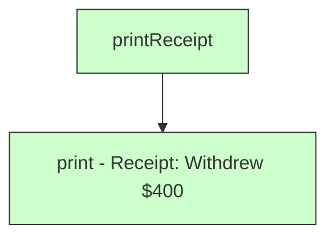
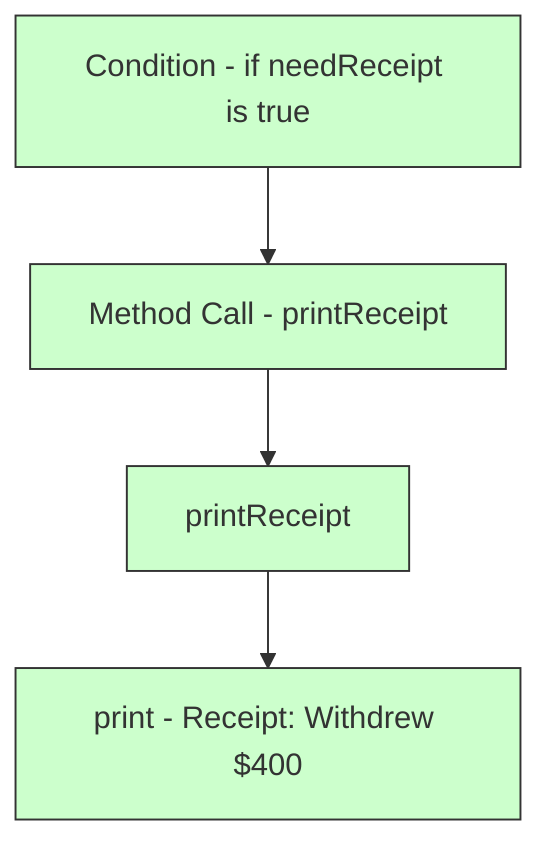
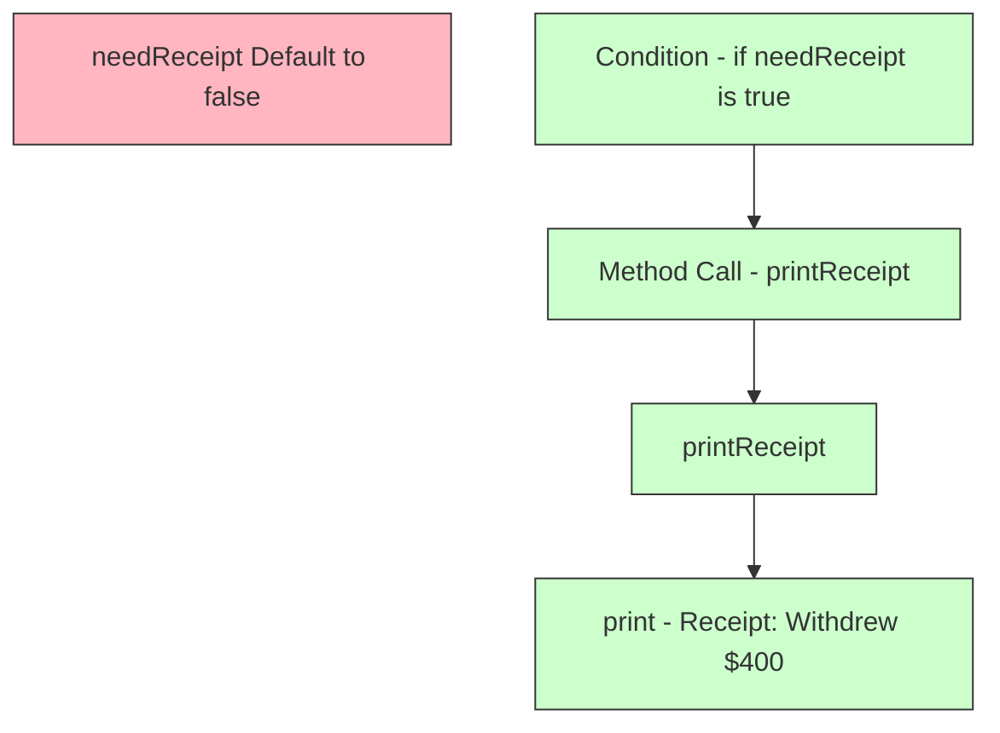
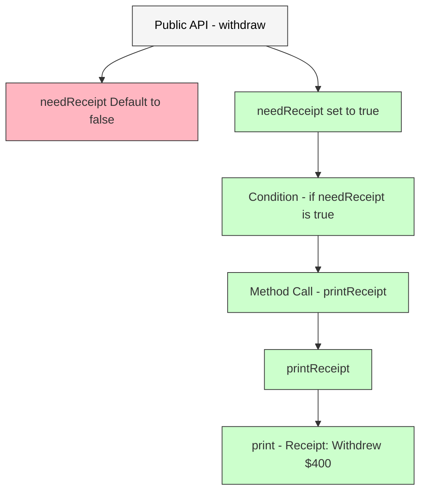

## Table of Contents

- [What is Behavioral Coverage?](#what-is-behavioral-coverage)
- [Understanding Behavioral Coverage and its Importance](#understanding-behavioral-coverage-and-its-importance)
- [Writing Effective Tests](#writing-effective-tests)
  - [Understand the Requirements](#1-understanding-the-requirements)
  - [Writing Clear and Descriptive Test Cases](#2-writing-clear-and-descriptive-test-cases)
  - [Focusing on Specific Test Cases](#3-focusing-on-specific-test-cases)
  - [Covering Different Scenarios](#4-covering-different-scenarios)
  - [Covering All Branches, Paths, and Conditions](#5-covering-all-branches-paths-and-conditions)
  - [Exception and Error Handling](#6-exception-and-error-handling)
- [Guidelines for Testing Public API](#guidelines-for-testing-public-api)
- [How to Map a Line of Code to Its Corresponding Behaviors?](#how-to-map-a-line-of-code-to-its-corresponding-behaviors)

# What is Behavioral Coverage?

Behavioral coverage refers to the practice of testing various behaviors or functional aspects of your code to ensure it operates correctly under different scenarios. Instead of merely executing lines of code, it focuses on validating that all specified behaviors, edge cases, and conditions are correctly handled by the code.

## Understanding Behavioral Coverage and its Importance

Focusing on behavioral coverage is essential because:

- Multiple Behaviors per Line: A single line of code can produce multiple behaviors depending on input values and conditions.
- Comprehensive Testing: High line coverage doesn’t guarantee all behaviors are tested. Behavioral coverage ensures every scenario, including edge cases and exceptions, is validated.
- Quality Over Quantity: Achieving high line coverage might give a false sense of security. Testing all possible behaviors ensures higher quality and robustness.

Let's understand it better with a sample function. Consider this function that validates a name:

```kotlin
fun getName(name: String? = " ") =
  name?.takeIf { it.all { char -> char.isLetterOrWhitespace() } }
    ?: throw IllegalArgumentException("Invalid name")
```

### Line Coverage Testing

A basic test case for line coverage might look like this:

```kotlin
@Test fun testValidName() {
  // Tests line coverage by hitting the line where name is accessed
  assertThat(getName("Alice"), equalTo("Alice")) 
}
```

**Line Coverage Result:** This test covers the line of code but doesn’t test all scenarios.

### Behavioural Coverage Testing

To ensure behavioral coverage, the test needs to verify various conditions:

```kotlin
@Test fun testGetName_withDefaultValue_result(getName()) {
  // Default value when no name is provided
  assertThat(getName(), equalTo(" ")) 
}

@Test fun testGetName_withNullName_throwsException() {
  // Exception for null value
  assertThrows<IllegalArgumentException> { getName(null) } 
}

@Test fun testGetName_withSpecialCharacters_throwsException() {
  // Exception for special characters
  assertThrows<IllegalArgumentException> { getName("!@#$%^&*()") } 
}

@Test fun testGetName_withEmptyName_result(getName("")) {
  // Empty string should use default value
  assertThat(getName(""), equalTo(" ")) 
}

@Test fun testGetName_withWhitespaceName_result(getName("   ")) {
  // Whitespace name
  assertThat(getName("   "), equalTo("   ")) 
}
```

**Behavioural Coverage Result:** These tests ensure that all potential behaviors, including edge cases and exceptions, are covered, providing a more thorough validation.

### Quality > Percentage

While line coverage might reach 100% with a single test, it doesn’t ensure that all scenarios are tested. Behavioral coverage ensures quality by validating all possible scenarios and edge cases, which is more important for reliable software.

For more details on testing methodologies specific to Oppia Android, please refer to the [Oppia Android Testing](https://github.com/oppia/oppia-android/wiki/Oppia-Android-Testing).

# Writing Effective Tests

Writing effective tests is crucial for ensuring that your code behaves correctly under various conditions. Good testing practices help you identify issues early, maintain high code quality, and ensure that changes or new features do not break existing functionality. This guide focuses on how to write tests that not only check if your code runs but also verify that it performs as expected in different scenarios.

## 1. Understanding the Requirements

Before you start writing tests, it's essential to thoroughly understand the requirements or specifications for the functionality you are testing. This ensures that your tests accurately reflect what the code is supposed to do.

#

**Example User Story and Specification:**

| **Aspect**               | **Details**                                   |
|--------------------------|-----------------------------------------------|
| **User Story**           | As a shopper, I want to check if an item’s price is within my budget. If the price is above my budget, I shouldn’t buy it. If it’s within my budget, I should buy it. |
| **Function Name**        | `shouldBuyItem`                               |
| **Inputs**               | - `price`: A double representing the item's price.<br>- `budget`: A double representing the maximum amount you’re willing to spend. |
| **Output**              | A boolean indicating whether the item should be bought. |
| **Behavior**            | - Return `true` if the price is less than or equal to the budget.<br>- Return `false` if the price is greater than the budget. |

**Requested Feature Code:**

The function to determine if an item should be bought based on the price and budget is,

```kotlin
fun shouldBuyItem(price: Double, budget: Double): Boolean {
  return price <= budget
}
```

**Respective Test Case:**

To ensure that the shouldBuyItem function works correctly, we can add the following test cases,

```kotlin
@Test
fun testShouldBuyItem_withPriceWithinBudget_returnsTrue() {
  assertThat(shouldBuyItem(50.0, 100.0)).isTrue()
}

@Test
fun testShouldBuyItem_withPriceAboveBudget_returnsFalse() {
  assertThat(shouldBuyItem(150.0, 100.0)).isFalse()
}
```

## 2. Writing Clear and Descriptive Test Cases

Each test case should:

- Clearly describe the scenario and expected outcome.
- Use descriptive names for your test methods.

Naming Convention:
```kotlin
testAction_withOneCondition_withSecondCondition_hasExpectedOutcome
```

Example:
```kotlin
testCheckSign_forPositiveInput_returnsPositive()
testCheckSign_forNegativeInput_returnsNegative()
testCheckSign_forZeroInput_returnsNeitherPositiveNorNegative()
```

## 3. Focusing on Specific Test Cases

When testing a function that performs multiple actions, it's crucial to write test cases that focus on individual aspects of the function. This approach allows you to isolate and identify issues more effectively if a test fails, rather than dealing with a more complex failure analysis.

### Why Focus on Specific Test Cases?
Testing one thing at a time helps:

- Identify Issues More Easily: If a test fails, you know precisely which aspect of the function is problematic.
- Improve Test Clarity: Each test case has a clear purpose, making tests easier to read and maintain.
- Isolate Failures: Helps in pinpointing issues related to a specific behavior or output.

Consider a function that manages a food order process. This function does the following:

1. Lists the food items.
2. Calculates the total price.
3. Display the order.
4. Checks if the payment has been made and provides the corresponding message.

```kotlin
fun processOrder(order: List<String>, paymentMade: Boolean): String {
  // List the food items
  val itemList = order.joinToString(", ")
    
  // Calculate total price (mocked here for simplicity)
  val totalPrice = order.size * 10.0
    
  // Display order
  println("Order: $itemList")
  println("Total: $totalPrice")
    
  // Payment status
  return if (paymentMade) "Payment successful" else "Payment pending"
}
```

**Potential output with payment made:**

```
Order: Pizza, Burger
Total: 20.0
Result: Payment successful
```

### Testing the Entire Functionality

**Single Test Case:**

```kotlin
@Test
fun testProcessOrder_allSteps_returnsCorrectMessage() {
  val result = processOrder(listOf("Pizza", "Burger"), paymentMade = true)
  assertThat(result).isEqualTo("Payment successful")
}
```

**Difficulties in Testing All Aspects Together:**

- Complex Failure Diagnosis: If this test fails, you need to diagnose whether the issue lies in listing items, calculating the total, displaying the order, or payment status.
- Less Focused: It does not target individual aspects of the function, making it harder to identify which specific action failed.

### Testing Specific Aspects

**Test Case 1: Testing Listing items**

```kotlin
@Test
fun testProcessOrder_providedWithList_displaysListOfItems() {
  processOrder(listOf("Pizza", "Burger"), paymentMade = true)
  val output = outContent.toString().trim()
  assertThat(output, containsString("Order: Pizza, Burger"))
}
```

**Test Case 2: Calculates Total**

```kotlin
@Test
fun testProcessOrder_forListItems_calculatesCorrectTotalPrice() {
  processOrder(listOf("Pizza", "Burger"), paymentMade = true)
  val output = outContent.toString().trim()
  assertThat(output, containsString("Total: 20.0"))
}
```

**Test Case 3: Payment Success**

```kotlin
@Test
fun testProcessOrder_whenPaymentMade_displaysPaymentSuccess() {
  processOrder(listOf("Pizza", "Burger"), paymentMade = true)
  val output = outContent.toString().trim()
  assertThat(output, containsString("Payment successful"))
}
```

**Test Case 4: Payment Pending**

```kotlin
@Test
fun testProcessOrder_whenNotPaymentMade_displaysPaymentPending() {
  processOrder(listOf("Pizza", "Burger"), paymentMade = false)
  val output = outContent.toString().trim()
  assertThat(output, containsString("Payment pending"))
}
```

**Benefits of specific test cases:**

- Clear Purpose: Each test case has a single, well-defined objective, making the tests more readable and maintainable.
- Easier Debugging: Focusing on one aspect makes it easier to pinpoint and fix issues.
- Improved Coverage: Ensures that each individual functionality of the method is tested thoroughly.

## 4. Covering Different Scenarios

To ensure robust testing, it's crucial to cover various scenarios your function might encounter. This involves testing the function with a range of inputs, including positive numbers, negative numbers, zero, and edge cases. Each scenario should be tested to verify that your function behaves correctly across different conditions.

Consider a function `checkSign` that takes an integer and returns a string indicating whether the number is positive, negative, or zero.

```kotlin
fun checkSign(number: Int): String {
  return when {
    number > 0 -> "Positive"
    number < 0 -> "Negative"
    else -> "Zero"
  }
}
```

### Testing different scenerios

Positive Number: Verifies that the function correctly identifies positive numbers.

```kotlin
@Test
fun testCheckNumber_forPositiveInput_returnsPositive() {
  assertThat(checkNumber(5), equalTo("Positive"))
}
```

Negative Number: Ensures that negative numbers are correctly classified.

```kotlin
@Test
fun testCheckNumber_forNegativeInput_returnsNegative() {
  assertThat(checkNumber(-3), equalTo("Negative"))
}
```

Zero: Checks that zero is handled correctly.

```kotlin
@Test
fun testCheckNumber_forZeroInput_returnsZero() {
  assertThat(checkNumber(0), equalTo("Zero"))
}
```

Maximum Value: Tests the function with Int.MAX_VALUE to ensure it handles the upper boundary.

```kotlin
@Test
fun testCheckNumber_forMaxValue_returnsPositive() {
  assertThat(checkNumber(Int.MAX_VALUE), equalTo("Positive"))
}
```

Minimum Value: Tests the function with Int.MIN_VALUE to ensure it handles the lower boundary.

```kotlin
@Test
fun testCheckNumber_forMinValue_returnsNegative() {
  assertThat(checkNumber(Int.MIN_VALUE), equalTo("Negative"))
}
```

## 5. Covering All Branches, Paths, and Conditions

Testing all branches, paths, and conditions within your code is essential to ensure that every possible execution path is verified. This approach helps in identifying edge cases and logic errors that could otherwise go unnoticed. Effective testing covers all possible scenarios, including combinations of conditions and branching logic.

Let's see the function to evaluate a user's access level based on their age and membership status.

```kotlin
fun evaluateAccess(age: Int, isMember: Boolean): String {
  var result: String

  if (age >= 18 && isMember) {
    result = "Access granted"
  } else if (age >= 18 && !isMember) {
    result = "Membership required"
  } else {
    result = "Access denied"
  }

  return result
}
```

The different scenarios and the expected outcomes are,

| Scenario         | Description                           | Expected Outcome           |
|------------------|---------------------------------------|----------------------------|
| Adult Member     | `age >= 18` and `isMember = true`     | Returns "Access granted"   |
| Adult Non-Member | `age >= 18` and `isMember = false`    | Returns "Membership required" |
| Minor Member     | `age < 18` and `isMember = true`      | Returns "Access denied"    |
| Minor Non-Member | `age < 18` and `isMember = false`     | Returns "Access denied"    |

Testing needs to be performed to cover all branches, paths and conditions.

```kotlin
@Test
fun testEvaluateAccess_forAdultMember_grantsAccess() {
  assertThat(evaluateAccess(25, true), equalTo("Access granted"))
}

@Test
fun testEvaluateAccess_forAdultNonMember_requiresMembership() {
  assertThat(evaluateAccess(30, false), equalTo("Membership required"))
}

@Test
fun testEvaluateAccess_forMinorMember_deniesAccess() {
  assertThat(evaluateAccess(16, true), equalTo("Access denied"))
}

@Test
fun testEvaluateAccess_forminorNonMember_deniesAccess() {
  assertThat(evaluateAccess(15, false), equalTo("Access denied"))
}
```

Testing all branches and conditions ensures that your function can handle all possible scenarios, making it more reliable and easier to maintain.

## 6. Exception and Error Handling

**Exception Handling:**

Exceptions are unexpected conditions or events that disrupt the normal flow of a program. They handle situations not part of the regular program flow, like invalid user input or file operation issues.

Examples:
- `NullPointerException` (accessing a null reference)
- `IllegalArgumentException` (invalid function argument)
- `IOException` (I/O operation failure)

This allows to catch and handle issues, allowing the program to continue running or fail in a controlled manner.

For instance, to handle division by zero error.

```kotlin
fun divide(a: Int, b: Int): Int {
  if (b == 0) throw ArithmeticException("Division by zero")
  return a / b
}
```

**Error Handling:**

Errors are more severe issues indicating fundamental problems with the program's environment or state, often beyond the program's control. In Java/Kotlin, these are represented by classes extending Error, like `OutOfMemoryError` or `StackOverflowError`.

This allows to manage situations where the application may not continue running properly, ensuring the program does not enter an unstable state.

For instance,

```kotlin
fun simulateError() {
  val arr = IntArray(Int.MAX_VALUE) // May cause OutOfMemoryError
}
```

### Testing Exceptions

Ensure that the code handles invalid or unexpected inputs gracefully and verify that appropriate errors or exceptions are triggered.

**Functionality:**

```kotlin
fun divideNumbers(numerator: Int, denominator: Int): Int {
  if (denominator == 0) throw IllegalArgumentException("Denominator cannot be zero")
  return numerator / denominator
}
```

**Test Case:**

```kotlin
@Test
fun testDivideNumbers_forZeroDenominator_throwsIllegalArgumentException() {
  val exception = assertThrows<IllegalArgumentException> {
    divideNumbers(10, 0)
  }
  assertThat(exception).contains("Denominator cannot be zero")
}
```

Testing exceptions and error handling is vital to ensure that applications behave correctly under error conditions, provide meaningful feedback, and maintain reliability. Without these tests, applications are prone to unpredictable failures, poor user experiences, and potential security issues.

### 1. Verifying Correct Exception Types

Ensure that the correct type of exception is thrown in response to error conditions. This confirms that your error handling logic is specific and accurate.

```kotlin
@Test
fun testDivideNumbers_forZeroDenominator_throwsIllegalArgumentException() {
  assertThrows<IllegalArgumentException> {
    divideNumbers(10, 0)
  }
}
```

### 2. Checking for Proper Exception Messages

When writing tests, it's crucial to ensure that exceptions thrown by your code contain meaningful and descriptive messages. These messages play a vital role in diagnosing issues, providing clarity on what went wrong and why it happened.

Let's consider a TicketBooking class that has a function to reserve a seat. This function checks if seats are available using Kotlin's check() function. If no seats are available, it throws an exception with a specific message.

**Functionality:**

```kotlin
class TicketBooking {
  fun reserveSeat(seatsAvailable: Int) {
    check(seatsAvailable > 0) {
      "No seats are available. Please check other bookings for available seats."
    }
    // Additional code to reserve a seat
  }
}
```

In this case, when the **seatsAvailable** becomes 0, the `check()` function will throw an `IllegalStateException` with the message "No seats are available. Please check other bookings for available seats."

**Test:**

To verify that the exception is thrown with the correct message, we write a test case:

```kotlin
@Test
fun testBookTickets_withUnavailableSeats_throwsException() {
  val booking = TicketBooking()
  val exception = assertThrows<IllegalStateException> {
    booking.reserveSeat(0)
  }
  assertThat(exception).contains("No seats are available. Please check other bookings for available seats.")
}
```

This test case checks that when no seats are available, the reserveSeat() function throws an `IllegalStateException` with the appropriate message.

### Why verify Exception Messages?

Verifying exception messages is crucial for ensuring the correctness and usefulness of your tests. This is especially important when dealing with generic exceptions, where multiple checks might throw the same type of exception.

To better understand this, let's extend the `TicketBooking` class with an additional function that checks the payment status before confirming a booking. This function uses `check()` to verify if the payment was successful. If not, it throws an exception with a specific message.

**Extended Functionality:**

```kotlin
class TicketBooking {
  fun reserveSeat(seatsAvailable: Int) {
    check(seatsAvailable > 0) {
      "No seats are available. Please check other bookings for available seats."
    }
    // Additional code to reserve a seat
  }

  fun confirmPayment(isPaymentSuccessful: Boolean) {
    check(isPaymentSuccessful) {
      "Payment not successful. Please try again."
    }
    // Additional code to confirm payment
  }
}
```

In this scenario, the `confirmPayment()` function throws an `IllegalStateException` if the payment is not successful, with the message "Payment not successful. Please try again."

### Importance of Specific Error Messages

Imagine if both checks in the `reserveSeat()` and `confirmPayment()` functions used generic messages like "Error occured" as:

```kotlin
check(seatsAvailable > 0) { "Error occurred" }
check(isPaymentSuccessful) { "Error occurred" }
```

In this case, when an exception is thrown, it becomes very challenging to determine the exact cause of the error. Did the error occur because there were no seats available, or because the payment was not successful? This ambiguity can make debugging difficult and reduce the effectiveness of your tests.

That is why it is necessary to test that each exception throws a specific error message relevant to its particular scenario—to help accurately diagnose where things went wrong. Consider the following test cases:

**Test for Seat Availability:**

```kotlin
@Test
fun testBookTickets_withUnavailableSeats_throwsException() {
  val booking = TicketBooking()
  val exception = assertThrows<IllegalStateException> {
    booking.reserveSeat(0)
  }
  assertThat(exception).contains("No seats are available. Please check other bookings for available seats.")
}
```

This test case ensures that when no seats are available, the correct exception with the appropriate message is thrown.

**Test for Payment Status:**

```kotlin
@Test
fun testConfirmPayment_withUnsuccessfulPayment_throwsException() {
  val booking = TicketBooking()
  val exception = assertThrows<IllegalStateException> {
    booking.confirmPayment(false)
  }
  assertThat(exception).contains("Payment not successful. Please try again.")
}

```

### 3. Ensuring Exceptions Are Thrown at Correct Times

Exceptions should be thrown only under specific conditions, not during normal operations. Verify that exceptions are correctly managed according to the context.

```kotlin
@Test
fun testDivideNumbers_forValidInputs_returnsExpectedResult() {
  val result = divideNumbers(10, 2)
  assertThat(result).isEqualTo(5)
}
```

### 4. Testing Edge Cases

Test edge cases where exceptions might be thrown, such as boundary values or extreme input scenarios.

**Function with Edge Case Handling:**

```kotlin
fun calculateDiscount(price: Double, discountPercent: Double): Double {
  if (price < 0 || discountPercent < 0) { 
    throw IllegalArgumentException("Price and discount cannot be negative")
  }
  return price - (price * discountPercent / 100)
}
```

**Test Case:**

```kotlin
@Test
fun testCalculateDiscount_forNegativePrice_throwsIllegalArgumentException() {
  val exception = assertThrows<IllegalArgumentException> {
    calculateDiscount(-100.0, 10.0)
  }
  assertThat(exception).contains("Price and discount cannot be negative")
}

@Test
fun testCalculateDiscount_forNegativeDiscount_throwsIllegalArgumentException() {
  val exception = assertThrows<IllegalArgumentException> {
    calculateDiscount(100.0, -10.0)
  }
  assertThat(exception).contains("Price and discount cannot be negative")
}
```

# Guidelines for Testing Public API

A public API (Application Programming Interface) refers to the set of methods, properties, and functionalities exposed by a class or module for use by external code. It defines how other parts of a system or external systems can interact with the functionality provided by that class or module.

Public APIs are essential because they provide a way to interact with the functionality of a class or module without exposing its internal workings. They define how external code can use the functionality offered by the class or module, ensuring that interactions are safe and predictable while keeping the internal implementation hidden and secure.

Let's consider the following example for a public API to withdraw money from the BankAccount.

```kotlin
class BankAccount(
  private var balance: Double, 
  private val username: String, 
  private val password: String 
) {

  // Public method to withdraw money
  fun withdraw(
    requestedUsername: String, // Username provided for the withdrawal
    requestedPassword: String, // Password provided for the withdrawal
    file: File? = null // Optional passbook file to upload to note transactions
    amount: Double, // Amount to withdraw
    needReceipt: Boolean = false // Flag to indicate if a receipt is needed, defaults to false
  ) {
    // Verify user credentials
    // Validate withdrawal amount
    // Perform the withdrawal operation
    // Print a receipt if needed
    println("Withdrawing $amount for $requestedUsername")
    if (needReceipt) {
      printReceipt(amount)
    }

    // Process the file if provided
    file?.let {
      processFile(it)
    }
  }

  private fun isValidUser(requestedUsername: String, requestedPassword: String): Boolean {
    return true
  }

  private fun isValidWithdrawal(amount: Double): Boolean {
    return true
  }

  private fun performWithdrawal(amount: Double) {
    println("Withdrew $amount. New balance is $balance")
  }

  private fun printReceipt(amount: Double) {
    println("Receipt: Withdrew $amount. Current balance: $balance")
  }

  private fun processFile(file: File) {
    println("Processing file: ${file.name}")
  }
}
```

The **`withdraw`** method serves as the single public entry point for withdrawing money from the account. It handles user validation, amount checking, optional file upload and printing of the receipt. By keeping the internal methods private, the class ensures that the operations are performed in a controlled manner while hiding the complexity of these operations from the user.

## Testing Public API

Testing a public API involves verifying that its methods and functionalities work as expected under various conditions. To ensure comprehensive coverage, it's important to focus on the behavior of the API rather than just individual lines of code.

### 1. Checking Pre-Conditions

Ensure the necessary setup, such as initializing bank data, is completed before running tests.

**Test:**

```kotlin
@Test
fun testWithdraw_noBankData_initializationError() {
  val account = BankAccount(null, null, null) // Initialize with null values
  
  val exception = assertThrows<IllegalStateException> {
    account.withdraw("user", "password", 200.0)
  }
  assertThat(exception).contains("Bank data not initialized")
}
```

This test ensures that if the bank data is not set up properly, the system throws an appropriate exception. This is important to verify that the API behaves correctly when initialization is incomplete.

### 2. Testing Valid Data

Verify that the API correctly processes valid input data.

```kotlin
@Test
fun testWithdraw_validData_outputsCorrectBalance() {
  val account = BankAccount(1000.0, "user", "password")
  val output = ByteArrayOutputStream()
  System.setOut(PrintStream(output))

  account.withdraw("user", "password", 200.0)

  val outputLines = output.toString().trim()
  assertThat(outputLines).isEqualTo("Withdrew 200.0. New balance is 800.0")
  System.setOut(System.out)
}
```

### 3. Testing Invalid Data

Ensure the API handles incorrect or invalid data properly.

```kotlin
@Test
fun testWithdraw_invalidUserName_throwsException() {
  val account = BankAccount(1000.0, "user", "password")

  val exception = assertThrows<IllegalArgumentException> {
    account.withdraw("invalidUser", "password", 200.0)
  }
  assertThat(exception).contains("Invalid credentials")
}

@Test
fun testWithdraw_invalidPassword_throwsException() {
  val account = BankAccount(1000.0, "user", "password")

  val exception = assertThrows<IllegalArgumentException> {
    account.withdraw("user", "invalidPassword", 200.0)
  }
  assertThat(exception).contains("Invalid credentials")
}
```

### 4. Testing Edge Cases

Verify the API's behavior with edge cases and boundary conditions.

```kotlin
@Test
fun testWithdraw_emptyUsername_throwsException() {
  val account = BankAccount(1000.0, "user", "password")

  val exception = assertThrows<IllegalArgumentException> {
    account.withdraw("", "password", 200.0)
  }
  assertThat(exception).contains("Username cannot be empty")
}

@Test
fun testWithdraw_emptyBalance_throwsException() {
  val account = BankAccount(0.0, "user", "password")

  val exception = assertThrows<IllegalArgumentException> {
    account.withdraw("user", "password", 200.0)
  }
  assertThat(exception).contains("Insufficient balance")
}

@Test
fun testWithdraw_emptyAmount_throwsException() {
  val account = BankAccount(1000.0, "user", "password")

  val exception = assertThrows<IllegalArgumentException> {
    account.withdraw("user", "password", 0.0)
  }
  assertThat(exception).contains("Invalid withdrawal amount")
}

@Test
fun testWithdraw_amountGreaterThanBalance_throwsException() {
  val account = BankAccount(1000.0, "user", "password")

  val exception = assertThrows<IllegalArgumentException> {
    account.withdraw("user", "password", 1500.0)
  }
  assertThat(exception).contains("Invalid withdrawal amount")
}
```

### 5. Testing Default Values

Verify the API's behaviour with different receipt parameter values.

```kotlin
@Test
fun testWithdraw_withDefaultReceipt_noReceiptPrinted() {
  val account = BankAccount(1000.0, "user", "password")
  val output = ByteArrayOutputStream()
  System.setOut(PrintStream(output))

  account.withdraw("user", "password", 200.0)

  val outputLines = output.toString().trim()
  assertThat(outputLines).doesNotContain("Receipt: Withdrew 200.0. Current balance: 800.0")
  System.setOut(System.out)
}

@Test
fun testWithdraw_withNeedReceipt_receiptPrinted() {
  val account = BankAccount(1000.0, "user", "password")
  val output = ByteArrayOutputStream()
  System.setOut(PrintStream(output))

  account.withdraw("user", "password", 200.0, needReceipt = true)

  val outputLines = output.toString().trim()
  assertThat(outputLines).contains("Receipt: Withdrew 200.0. Current balance: 800.0")
  System.setOut(System.out)
}

@Test
fun testWithdraw_withoutNeedReceipt_noReceiptPrinted() {
  val account = BankAccount(1000.0, "user", "password")
  val output = ByteArrayOutputStream()
  System.setOut(PrintStream(output))

  account.withdraw("user", "password", 200.0, needReceipt = false)

  val outputLines = output.toString().trim()
  assertThat(outputLines).doesNotContain("Receipt: Withdrew 200.0. Current balance: 800.0")
  System.setOut(System.out)
}
```

These tests check if the receipt value is correctly processed. They ensure that receipts are printed when requested and not printed otherwise.

### 6. Testing Validity of File

Testing how an API handles file inputs is crucial because:

1. File Format Validation: Ensures that only acceptable file formats are processed, avoiding potential errors or security issues.
2. File Existence: Confirms that the API properly handles cases where files are missing, preventing unexpected failures.
3. File Processing: Validates that the API processes files correctly when they are valid, ensuring proper functionality.

**Test:**

a. Testing with Invalid File Format

```kotlin
@Test
fun testWithdraw_withInvalidFileFormat_throwsException() {
  val account = BankAccount(1000.0, "user", "password")
  val invalidFile = File("invalidFile.txt") // File with an invalid format

  val exception = assertThrows<IllegalArgumentException> {
    account.withdraw("user", "password", 200.0, file = invalidFile)
  }
  assertThat(exception).contains("Invalid file format")
}
```

b. Testing with Unavailable File

```kotlin
@Test
fun testWithdraw_withUnavailableFile_throwsException() {
  val account = BankAccount(1000.0, "user", "password")
  val unavailableFile = File("nonExistentFile.pdf") // File that does not exist

  val exception = assertThrows<IllegalArgumentException> {
    account.withdraw("user", "password", 200.0, file = unavailableFile)
  }
  assertThat(exception).contains("File not found")
}
```

c. Testing with Valid File

```kotlin
@Test
fun testWithdraw_withValidFile_processesFile() {
  val account = BankAccount(1000.0, "user", "password")
  val validFile = File("passbook.pdf")
  validFile.createNewFile() // Ensure the file exists for the test

  val output = ByteArrayOutputStream()
  System.setOut(PrintStream(output))

  account.withdraw("user", "password", 200.0, file = validFile)

  assertThat(output.toString().trim()).isEqualTo("Processing file: passbook.pdf")
  System.setOut(System.out)
}
```

These tests collectively cover critical aspects of file handling, ensuring robust and reliable API functionality.

### 7. Testing Absence of Unwanted Output

In addition to validating correct handling of valid and invalid files, it's also important to ensure that unwanted output or behavior does not occur.

**Test:**

a. Ensure No Processing Message for Missing File

```kotlin
@Test
fun testWithdraw_withNoFile_producesNoFileProcessingOutput() {
  val account = BankAccount(1000.0, "user", "password")

  val output = ByteArrayOutputStream()
  System.setOut(PrintStream(output))

  account.withdraw("user", "password", 200.0) // No file provided

  assertThat(output.toString().trim()).doesNotContain("Processing file")
  System.setOut(System.out)
}
```

This test ensures that no unwanted methods, such as file processing, are called when the file parameter is not provided, thereby verifying that the API behaves as expected without unnecessary actions.

b. Ensure No Receipt Message for Default Value

```kotlin
@Test
fun testWithdraw_withDefaultReceipt_noReceiptPrinted() {
  val account = BankAccount(1000.0, "user", "password")
  val output = ByteArrayOutputStream()
  System.setOut(PrintStream(output))

  account.withdraw("user", "password", 200.0) // Using default receipt flag (false)

  assertThat(output.toString().trim()).doesNotContain("Receipt:")
  System.setOut(System.out)
}
```

This test verifies that no receipt message is output when the default receipt flag is in use, ensuring that the API respects the default behavior and does not produce unintended output.

### 8. Testing a Single Outcome in Multiple Ways

When testing a single outcome like a successful withdrawal, you can use multiple approaches to verify the if the balance is updated correctly. Here are different ways to ensure the single outcome of withdrawal was processed correctly, each following a distinct approach.

**a. To verify correctness of output:**

Verifies that after withdrawing $200, the balance is updated to $800. This checks that the core functionality of updating the balance works correctly.

```kotlin
@Test
fun testWithdraw_withSufficientBalance_updatesBalance() {
  val output = ByteArrayOutputStream()
  System.setOut(PrintStream(output))

  account.withdraw("user", "password", 200.0)

  assertThat(output.toString().trim()).isEqualTo("Withdrew 200.0. New balance is 800.0")
  System.setOut(System.out)
}
```

**b. To verify with receipt:**

Ensures that when a receipt is requested, it includes the correct balance details of the withdrawal.

```kotlin
@Test
fun testWithdraw_withReceipt_generatesReceipt() {
  val output = ByteArrayOutputStream()
  System.setOut(PrintStream(output))

  account.withdraw("user", "password", 200.0, needReceipt = true)

  assertThat(output.toString().trim()).contains("Receipt: Withdrew 200.0. Current balance: 800.0")
  System.setOut(System.out)
}
```

**c. To verify with passbook details:**

Confirms balance statement with the passbook file being updated when a file is provided.

```kotlin
@Test
fun testWithdraw_withPassbook_updatesPassbook() {
  val passbookFile = File("passbook.pdf")
  passbookFile.createNewFile()
  val output = ByteArrayOutputStream()
  System.setOut(PrintStream(output))

  account.withdraw("user", "password", 200.0, file = passbookFile)

  // Read the passbook file and check its contents
  val fileContents = passbookFile.readText()
  assertThat(fileContents).contains("Withdrew 200.0. New balance is 800.0")

  System.setOut(System.out)
}
```

**d. To verify based on the log message:**

Validates that the correct message about the withdrawal is logged.

```kotlin
@Test
fun testWithdraw_withSufficientBalance_logsCorrectMessage() {
  val output = ByteArrayOutputStream()
  System.setOut(PrintStream(output))

  account.withdraw("user", "password", 200.0)

  assertThat(output.toString().trim()).contains("New balance is 800.0")
  System.setOut(System.out)
}
```

**e. To verify with the balance is updated correctly:**

Ensures that the balance is updated correctly after a withdrawal.

```kotlin
@Test
fun testWithdraw_withSufficientBalance_updatesBalanceCorrectly() {
  account.withdraw("user", "password", 200.0)
  assertThat(account.balance).isEqualTo(800.0)
}
```

These tests cover various aspects of the withdrawal functionality, ensuring that the balance updates correctly with receipts, passbooks and output messages. Although the core functionality of withdrawing funds and updating the balance is consistent, it can be observed in multiple ways. Each test focuses on a specific verification method while ultimately validating the same core functionality.

## Testing Practices for Effective Validation

The following best practices are meant to assist in the organization and execution of tests. By following these guidelines, you can ensure that your testing process is efficient, thorough, and well-structured.

### 1. Use of Helper Functions

Helper functions are crucial for avoiding repetitive code, especially for pre-setup tasks that are used across multiple test cases. In this scenario, initializing the bank data or ensuring the proper state of the BankAccount object can be encapsulated in helper functions.

```kotlin
// Helper function to initialize a BankAccount with default data
fun createDefaultBankAccount(): BankAccount {
  return BankAccount(1000.0, "user", "password")
}
```

This helps to reduce redundancy and maintain consistency across multiple test cases by centralizing repetitive setup tasks.

### 2. Setup and Teardown using `@Before` and `@After`

Using `@Before` and `@After` annotations ensures that common setup and cleanup tasks are automatically executed before and after each test case, maintaining a clean and consistent test environment.

**Example:**

```kotlin
class BankAccountTests {

  private lateinit var account: BankAccount

  @Before
  fun setUp() {
    // Initialize a BankAccount instance before each test
    account = createDefaultBankAccount()
  }

  @After
  fun tearDown() {
    // Clean up any resources or data after each test
    
    // Restore the original system output stream after test
    System.setOut(System.out)
  }

  // Test cases here
}
```

### 3. Descriptive Test Names

Naming test functions descriptively helps in identifying the purpose and scope of each test. Use names that reflect the specific behavior being tested.

```kotlin
@Test
fun testWithdraw_withValidData_updatesBalance() {
  val output = ByteArrayOutputStream()
  System.setOut(PrintStream(output))

  account.withdraw("user", "password", 200.0)

  // Check that the withdrawal output is correct and no exceptions are thrown
  assertThat(output.toString().trim()).contains("Withdrew 200.0. New balance is 800.0")
  System.setOut(System.out)
}

@Test
fun testWithdraw_withNoFile_producesNoFileProcessingOutput() {
  val output = ByteArrayOutputStream()
  System.setOut(PrintStream(output))

  account.withdraw("user", "password", 200.0)

  // Ensure no file processing message is output when no file is provided
  assertThat(output.toString().trim()).doesNotContain("Processing file")
  System.setOut(System.out)
}

@Test
fun testWithdraw_withInvalidFileFormat_throwsException() {
  val invalidFile = File("invalidFile.txt")

  // Verify that an invalid file format results in an appropriate exception
  val exception = assertThrows<IllegalArgumentException> {
    account.withdraw("user", "password", 200.0, file = invalidFile)
  }
  assertThat(exception.message).contains("Invalid file format")
}

@Test
fun testWithdraw_withUnavailableFile_throwsException() {
  val unavailableFile = File("nonExistentFile.pdf")

  // Verify that attempting to use a non-existent file results in an exception
  val exception = assertThrows<IllegalArgumentException> {
    account.withdraw("user", "password", 200.0, file = unavailableFile)
  }
  assertThat(exception.message).contains("File not found")
}

@Test
fun testWithdraw_withDefaultReceipt_noReceiptPrinted() {
  val output = ByteArrayOutputStream()
  System.setOut(PrintStream(output))

  account.withdraw("user", "password", 200.0)

  // Ensure that no receipt is printed when the default receipt flag is used
  assertThat(output.toString().trim()).doesNotContain("Receipt:")
  System.setOut(System.out)
}
```

**Importance of Specific Naming and Conditions:**

- Clarity: Specific names and conditions make tests easier to understand and manage.
- Focus: Helps pinpoint exact scenarios being tested, improving test coverage.
- Debugging: Clear names and conditions aid in quickly identifying the cause of failures.
- Documentation: Serves as self-documentation, providing insight into test purpose and scope.
- Maintenance: Simplifies updates and modifications by clearly defining what each test covers.

# How to Map a Line of Code to Its Corresponding Behaviors

Understanding how to map a line of code to its corresponding behaviors is essential for improving code coverage and writing effective tests. Here’s a structured approach to locate and cover lines of code:

Let's use our Bank API code from previous examples to understand how to map uncovered lines of code to their corresponding behaviors and effectively write tests to cover them.

Consider that our test suite covers the code as follows:

**Test:**

```kotlin
@Test
fun testWithdraw_withValidCredentials_printsWithdrawMessage() {
  val account = BankAccount(1000.0, "user", "password")
  val file = File("file.pdf")

  val output = ByteArrayOutputStream()
  System.setOut(PrintStream(output))

  account.withdraw("user", "password", 200.0, file = file)

  assertThat(output.toString().trim()).contains("Receipt: Withdrew 200.0. Current balance: 800.0")
  System.setOut(System.out)
}
```

This validates the code behaviour to function properly with valid inputs.

### 1. Identify the Line of Code

You can utilize the Oppia Android code coverage tool to assess the coverage for this code. This will generate an HTML report that helps you visualize the lines covered in green highlight and those not covered in red highlight.


Analyzing the report reveals that the line,

```kotlin
println("Receipt: Withdrew $amount. Current balance: $balance")
``` 

and its function call `printReceipt` are marked in red, indicating that this line was never executed by the test case. This suggests that the functionality is not covered by the current tests, potentially exposing it to issues or regressions if the code is modified in the future. The green highlights indicate the lines of code that are covered by test cases.

For more information on how to utilize the code coverage analysis tool, please refer to the [Oppia Android Code Coverage](https://github.com/oppia/oppia-android/wiki/Oppia-Android-Code-Coverage) page.

### 2. Map to the Line of Code

**1. Locate the Uncovered Line:**

Locate to the corresponding line number of the uncovered line in the source file. That would locate to these lines:

BankAccount.kt

```kotlin
private fun printReceipt(amount: Double) {
  println("Receipt: Withdrew $amount. Current balance: $balance")
}
```

Flow Diagram



**2. Traceback to the calling point:**

Next, trace the uncovered line back to where it is called in the code. This helps to understand why it wasn’t executed by the test case.

```kotlin
fun withdraw(
  requestedUsername: String,
  requestedPassword: String,
  amount: Double,
  needReceipt: Boolean = false, // Defaults to false
  file: File? = null
) {
  // Other code here

  if (needReceipt) {                                 --------------------.         
    printReceipt(amount)                                                 :
  }                                                                      :
}                                                                        :
                                                                         :
...                                                                      :
                                                      < -----------------`
private fun printReceipt(amount: Double) {           
  println("Receipt: Withdrew $amount. Current balance: $balance")
}
```

2.1 The Conditional Call

Identify the condition that controls whether the line of code is executed. Here it is the condition to have the value of **needReceipt** set to **true** to call the `printReceipt` method.

```kotlin
if (needReceipt) {
  printReceipt(amount)
}
```

Flow Diagram



2.2 Determine the Origin of the Conditional Value

Next, trace where this conditional value is set in the method. This helps to identify the requirement of the condition to set a passing value and access the method call.

```kotlin
fun withdraw(
  requestedUsername: String,
  requestedPassword: String,
  amount: Double,
  needReceipt: Boolean = false, // Defaults to false     ---------.
  file: File? = null                                              :
) {                                                               :
                                                                  :  
  if (needReceipt) {                      <-----------------------`
    printReceipt(amount)
  }
}
```

Flow Diagram



It can be seen that the **needReceipt** value is passed as a parameter while having a **default value** of **false**. Since the value was **never set to true** in our test case,

```kotlin
@Test
fun testWithdraw_withValidCredentials_printsWithdrawMessage() {
  ...

  account.withdraw("user", "password", 200.0, file = file)

  ...
}
```

it defaulted to being false thereby never meeting the condition to perform the `printReceipt`.

2.3 Trace Back to the Method Call

Identify the method or function that influences the needReceipt parameter and trace it to the public API where it is used. By understanding this connection, you can modify the needReceipt parameter’s default value in withdraw to affect the behavior of the code.

```kotlin
fun withdraw(
  requestedUsername: String,
  requestedPassword: String,
  amount: Double,
  needReceipt: Boolean = false, // Defaults to false   
  file: File? = null                                          
) {  }
```

Flow Diagram



**3. Add Test Case to Cover the Line:**

To ensure that the `printReceipt` method is covered, we need to add a test case that sets the **needReceipt** parameter to **true**.

Test:

```kotlin
@Test
fun testWithdraw_withReceipt_printsReceipt() {
  val output = ByteArrayOutputStream()
  System.setOut(PrintStream(output))

  // Call withdraw with needReceipt set to true
  account.withdraw("user", "password", 200.0, needReceipt = true)

  // Verify that receipt was printed
  assertThat(output.toString().trim()).contains("Receipt: Withdrew 200.0. Current balance: 800.0")
  System.setOut(System.out)
}
```

This test ensures that the `printReceipt` method is invoked and behaves as intended. By covering this line, you verify that the receipt functionality is properly executed, which is crucial for ensuring complete test coverage and the reliability of the feature.

Performing a code coverage analysis with the added test case would generate a report as below:


By following these steps, you can effectively map an uncovered line of code to its calling point and understand why it was not covered. Adjusting your test cases to trigger the conditions required for the line to be executed will help ensure comprehensive test coverage and minimize the risk of regression issues.