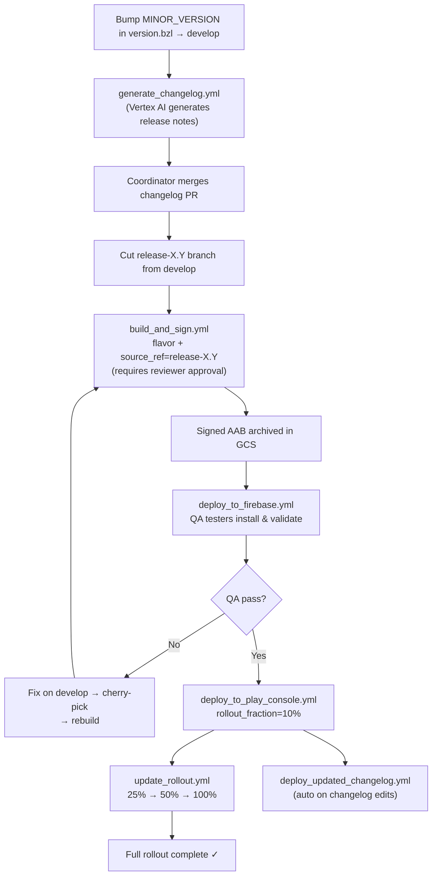
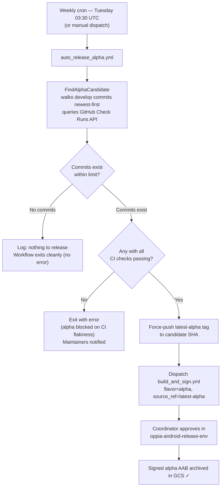
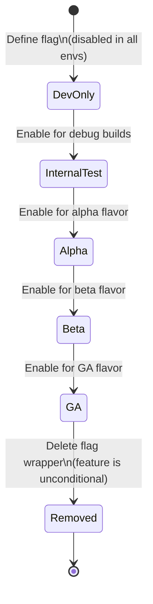

# App and Feature Release Process

This page describes the end-to-end lifecycle for releasing app binaries and managing feature flags
in oppia-android. It is the canonical replacement for the old private release Google Doc and is
intended for **release coordinators** and any contributor who wants to understand how a change
reaches end users.

---

## Table of Contents

1. [Prerequisites & Roles](#1-prerequisites--roles)
2. [Binary Release Lifecycle](#2-binary-release-lifecycle)
   - [2.1 Version numbering](#21-version-numbering)
   - [2.2 Changelog management](#22-changelog-management)
   - [2.3 Release branch creation](#23-release-branch-creation)
   - [2.4 Build & Sign](#24-build--sign)
   - [2.5 QA via Firebase App Distribution](#25-qa-via-firebase-app-distribution)
   - [2.6 Deploy to Play Console](#26-deploy-to-play-console)
   - [2.7 Staged rollout management](#27-staged-rollout-management)
   - [2.8 Changelog updates post-release](#28-changelog-updates-post-release)
   - [2.9 Automated alpha releases](#29-automated-alpha-releases)
   - [2.10 Automated lesson version updates](#210-automated-lesson-version-updates)
3. [Feature Flag Lifecycle](#3-feature-flag-lifecycle)
4. [Diagrams](#4-diagrams)
   - [4.1 End-to-end binary release flow](#41-end-to-end-binary-release-flow)
   - [4.2 Automated alpha release flow](#42-automated-alpha-release-flow)
   - [4.3 Feature flag lifecycle](#43-feature-flag-lifecycle)
5. [Workflow Quick-Access Table](#5-workflow-quick-access-table)

---

## 1. Prerequisites & Roles

### Release Coordinator
The release coordinator is responsible for triggering all manual GitHub Actions workflows
described in this page. The release coordinator is either the tech lead, or any other approved
`dev-workflow` or `infrastructure reviewer` codeowner.

**Access required by the coordinator:**

| Access | Purpose |
|---|---|
| GitHub: `oppia-android-release-env` environment | Approve build/sign/deploy jobs before they run |
| GitHub: `oppia-android-automation-env` environment | Approve automated PR-creation workflows |

**Access pre-configured for the automation (as GitHub environment secrets — no manual setup needed by the coordinator):**

| Access | Purpose |
|---|---|
| GCP: Workload Identity Federation service account | Sign binaries via Cloud KMS, read/write GCS archive |
| GCP: Cloud KMS — `oppia-android-release-key` | HSM-backed signing key (key never leaves KMS) |
| Google Play Console: "Release to production" permission | Upload AABs and update track releases |

> **Note:** The `oppia-android-release-env` environment enforces a **required reviewer approval**
> gate. No build, signing, or deployment step executes until an authorized reviewer explicitly
> approves the run in the GitHub Actions UI.

---

## 2. Binary Release Lifecycle

### 2.1 Version numbering

The app's version is maintained in [`version.bzl`](../version.bzl) at the repository root:

```python
MAJOR_VERSION = 0
MINOR_VERSION = 18
```

- `MINOR_VERSION` is incremented for each release (e.g. 0.17 → 0.18).
- `MAJOR_VERSION` changes only for breaking platform changes or major product milestones.
- The resulting `versionName` is `"{MAJOR}.{MINOR}"` (e.g. `"0.18"`).
- A version update is performed by committing a `MINOR_VERSION` bump to `develop`.
  This automatically triggers changelog generation (see [§2.2](#22-changelog-management)).

### 2.2 Changelog management

**Trigger:** Automatically on every push to `develop` that modifies `version.bzl`, or manually
via `workflow_dispatch` of the `generate_changelog.yml` workflow.

**What it does:**

1. Identifies all commits on `develop` since the previous version tag.
2. Passes them to `GenerateChangelogs.kt`, which uses Vertex AI to produce user-facing release
   notes.
3. Opens a PR to `develop` adding a new changelog file.

**Changelog file paths:**

| File | Applies to |
|---|---|
| `config/changelogs/0.18.md` | All flavors (default) |
| `config/changelogs/0.18_alpha.md` | Alpha flavor only (overrides default) |
| `config/changelogs/0.18_beta.md` | Beta flavor only (overrides default) |

A flavor-specific file always takes precedence over the generic one for its corresponding Play
Console track.

**Coordinator action:** Review and merge the opened changelog PR. Edit the release notes if the
AI summary needs adjustment before merging.

---

### 2.3 Release branch creation

After the version bump and changelog PR have landed on `develop`:

1. Cut a release branch from `develop` HEAD:
   ```
   git checkout -b release-0.18 upstream/develop
   git push upstream release-0.18
   ```
2. Do **not** commit directly to the release branch after the cut. If a critical fix is needed,
   merge it to `develop` first and then cherry-pick the commit onto the release branch.

---

### 2.4 Build & Sign

**Trigger:** Manual (`workflow_dispatch`) — requires coordinator to fill in the inputs below.

**Inputs:**

| Input | Description | Example |
|---|---|---|
| `flavor` | App flavor to build | `alpha`, `beta`, `ga` |
| `source_ref` | Branch or tag to build from | `release-0.18`, `latest-alpha` |

**What it does:**

1. Checks out the specified `source_ref`.
2. Builds the release AAB using Bazel.
3. Signs the AAB using Cloud KMS (HSM-backed — the private key never leaves KMS).
4. Archives the signed AAB to GCS:
   ```
   gs://oppia-android-{flavor}-releases/{version}/RC{n}/oppia-android-{version}-rc{n}-{flavor}-{sha}.aab
   ```
5. Prints the full GCS path in the job summary — **copy this path** for use in the next steps.

> **Note:** This workflow runs in the `oppia-android-release-env` GitHub environment, which
> requires an authorized reviewer to **approve** the run before any step executes.

---

### 2.5 QA via Firebase App Distribution

**Trigger:** Manual (`workflow_dispatch`) — run this after `build_and_sign.yml` succeeds.

**Inputs:**

| Input | Description |
|---|---|
| `gcs_aab_path` | Full GCS path from the `build_and_sign` job output |
| `release_notes` | Optional QA notes shown to testers in the Firebase console |

**What it does:**

1. Downloads the signed AAB from GCS.
2. Distributes it to Firebase App Distribution.
3. Automatically notifies the relevant tester group for the given flavor (the tester group
   assignment is configured in the workflow — no manual coordinator action needed for the
   notification).

QA testers can then install the build via the Firebase App Distribution app and validate it
before the coordinator proceeds to the Play Console deployment.

The app's Play Store listing is at:
[https://play.google.com/store/apps/details?id=org.oppia.android](https://play.google.com/store/apps/details?id=org.oppia.android)

---

### 2.6 Deploy to Play Console

**Trigger:** Manual (`workflow_dispatch`) — run this after QA sign-off.

> **Note:** This workflow runs in the `oppia-android-release-env` environment, which requires
> an authorized reviewer to **approve** the run before any step executes.

**Inputs:**

| Input | Description | Example |
|---|---|---|
| `gcs_aab_path` | Full GCS path from `build_and_sign` | `gs://…/oppia-android-0.18-rc01-alpha-abc1234.aab` |
| `track` | Play Console track to deploy to | `alpha`, `beta`, `ga` |
| `rollout_fraction` | Initial staged rollout as integer [0, 1000] where 1000 = 100% (optional, default: `1000`) | `100` for 10% |

**What it does:**

1. Downloads the signed AAB from GCS.
2. Runs `UploadBinaryToPlayConsole.kt`, which enforces the following preconditions before uploading:
   - **No version inversion** — fails if the version being deployed is lower than what's currently
     live on the target track.
   - **No duplicate deploy** — fails if the commit SHA is already live on that track.
   - **Changelog must exist** — fails if `config/changelogs/{version}.md` (or a flavor override)
     does not exist.
3. Uploads the AAB to the specified Play Console track at the requested rollout fraction.

> **Note:** Start with a low rollout fraction (e.g. 10%) and monitor crash rates in Firebase
> Crashlytics before expanding.

---

### 2.7 Staged rollout management

**Trigger:** Manual (`workflow_dispatch`) — run this each time you want to increase the rollout
percentage for a live release.

**Inputs:**

| Input | Description | Example |
|---|---|---|
| `track` | Play Console track to update | `alpha`, `beta`, `production` |
| `version` | Version in `major.minor` format — must match a live release on the track | `0.18` |
| `rollout_fraction` | New rollout as integer [0, 1000] where 1000 = 100% | `500` for 50% |

**What it does:**

Calls `UpdateRolloutFraction.kt`, which uses the Play Developer API to update the staged rollout
fraction for the current live release on the target track — **without re-uploading the binary**.

**Typical progression:**

```
10% → (monitor 24h) → 25% → (monitor 48h) → 50% → (monitor) → 100%
```

A concurrency lock shared with `deploy_updated_changelog.yml` prevents two simultaneous Play
Console edit sessions (the Play Developer API enforces a single active edit per package at a time).

---

### 2.8 Changelog updates post-release

**Trigger:**
- **Automatic** — on every push to `develop` that modifies any file matching
  `config/changelogs/**.md`
- **Manual** — via `workflow_dispatch` with `version` and optional `flavor` inputs

**What it does:**

1. Identifies the changelog file for the specified version (and flavor, if provided).
2. Runs `UploadChangelogToPlayConsole.kt`, which:
   - **Fails** if the version is not yet live on Play Console — this prevents a race condition
     against the initial binary deployment.
   - Compares the local release notes against what is currently deployed on Play Console.
   - Uploads only the changed or added translations.

This means you can edit `config/changelogs/0.18.md` directly on `develop` at any time after a
release goes live, and the changes will automatically sync to the Play Console store listing.

---

### 2.9 Automated alpha releases

**Trigger:**
- **Automatic** — weekly cron every **Tuesday at 03:30 UTC**
- **Manual** — via `workflow_dispatch` of the `auto_release_alpha.yml` workflow (useful for off-schedule alpha cuts)

**What it does:**

1. Runs `FindAlphaCandidate.kt`, which:
   - Fetches the most recent commits on `develop` (up to a configurable limit, default 50).
   - Walks them newest-first, querying the GitHub Check Runs API for each commit.
   - Returns the **first (newest) SHA** where every check run has completed with a passing,
     skipped, or neutral conclusion. A **neutral** conclusion covers check runs that completed
     without a definitive pass or fail — for example, a check that was skipped because it did
     not apply to that commit, or one cancelled by a later push to the same branch.
2. Force-pushes the `latest-alpha` tag to that commit SHA.
3. Dispatches `build_and_sign.yml` with `flavor=alpha` and `source_ref=latest-alpha`.

A release coordinator still approves the build step via `oppia-android-release-env` before
signing runs — the automation removes the manual "find a good commit and tag it" step, not the
human sign-off on the actual binary.

If no passing commit is found within the configured limit, the outcome depends on why:

- **Commits exist but none have passing CI** — the workflow exits with an error to alert
  repository maintainers that the alpha channel is blocked on CI flakiness.
- **No commits at all within the limit** — the workflow logs this and exits cleanly without
  failing, since there is nothing new to release.

---

### 2.10 Automated lesson version updates

**Trigger:**
- **Automatic** — weekly cron every **Monday at 02:30 UTC**
- **Manual** — via `workflow_dispatch` of the `pull_latest_lesson_versions.yml` workflow

**What it does:**

1. Runs the `download_lesson_list` Bazel script against the live Oppia production server for
   both `alpha` and `prod` flavors.
2. Updates the pinned lesson version files:
   - `config/lessons/alpha_pinned_lesson_versions.textproto`
   - `config/lessons/prod_pinned_lesson_versions.textproto`
3. Opens a PR to `develop` on the dedicated `automated/lesson-versions` branch containing only
   the updated textproto diff (idempotent — if files are already current, no commit or PR is
   created).

**Coordinator action:** Review and merge the opened lesson-versions PR.

> **Note:** The workflow uses `BOT_TOKEN` rather than `GITHUB_TOKEN` for PR creation so that
> CI is properly triggered on the opened PR. The dedicated branch is force-pushed on every run,
> keeping the PR diff clean regardless of how many runs have occurred.

---

## 3. Feature Flag Lifecycle

Feature flags (called **platform parameters** in this codebase) allow features to be developed
and deployed incrementally — enabled for one flavor or environment at a time — without gating
on a full release.

See the **[Platform Parameters & Feature Flags](Platform-Parameters-&-Feature-Flags.md)** wiki
page for the complete guide on defining, enabling, graduating, and removing flags.

**Summary of states:**

The table below summarises the progression stages. The exact enum values and enabling
conditions are defined in [`PlatformParameterValue`](../app/src/main/java/org/oppia/android/app/model/)
and documented in full on the
[Platform Parameters & Feature Flags](Platform-Parameters-&-Feature-Flags.md) wiki page.

| Stage | Who sees it |
|---|---|
| Dev-only | Local development builds only |
| Internal/test | Internal/debug flavor builds |
| Alpha | Alpha Play Store track |
| Beta | Beta Play Store track |
| GA (general availability) | All users |
| Removed | Flag wrapper deleted; feature is unconditional |

Graduating a flag from one stage to the next does **not** require a new binary release — it is
done by updating the flag's default value in code and merging to `develop`. The change reaches
users on the next alpha automation cycle or the next manual release, depending on the target stage.

---

## 4. Diagrams

### 4.1 End-to-end binary release flow



### 4.2 Automated alpha release flow



### 4.3 Feature flag lifecycle



---

## 5. Workflow Quick-Access Table

| Workflow file | Trigger | Key inputs | Purpose |
|---|---|---|---|
| `generate_changelog.yml` | Push to develop (version.bzl) / manual | `version` | Generate AI release notes, open changelog PR |
| `build_and_sign.yml` | Manual + reviewer approval | `flavor`, `source_ref` | Build AAB, sign via KMS, archive to GCS |
| `deploy_to_firebase.yml` | Manual | `gcs_aab_path` | Distribute to QA testers via Firebase |
| `deploy_to_play_console.yml` | Manual | `gcs_aab_path`, `track`, `rollout_fraction` [0-1000] | Upload to Play Console track |
| `update_rollout.yml` | Manual | `track`, `version`, `rollout_fraction` [0-1000] | Increase staged rollout percentage |
| `deploy_updated_changelog.yml` | Push to develop (`changelogs/**`) / manual | `version`, `flavor` | Sync edited release notes to Play Console |
| `auto_release_alpha.yml` | Weekly cron (Tue 03:30 UTC) / manual | `branch`, `commit_limit` | Automated weekly alpha cut |
| `pull_latest_lesson_versions.yml` | Weekly cron (Mon 02:30 UTC) / manual | — | Update pinned lesson version textprotos, open PR |

---

## 6. How to Manually Trigger a Workflow

All manual workflows in this release process use GitHub's `workflow_dispatch` trigger. Here is
how to run one:

**Step 1 — Open the Actions tab and select the workflow**

Navigate to the **Actions** tab of the `oppia/oppia-android` repository and click the workflow
you want to run from the left-hand sidebar. Then click the **"Run workflow"** button on the
right.


**Step 2 — Fill in the inputs**

A dropdown appears with a branch selector and the workflow's input fields. Select the correct
branch and fill in all required inputs (refer to the relevant section above for the expected
values).


**Step 3 — Confirm and approve**

Click **"Run workflow"** to queue the run. For workflows that run in the
`oppia-android-release-env` environment, a reviewer approval gate will appear — an authorized
reviewer must approve the run in the GitHub Actions UI before any step executes.


---

*See also: [Interpreting CI Results](Interpreting-CI-Results.md) · [Platform Parameters & Feature Flags](Platform-Parameters-&-Feature-Flags.md) · [Instructions for Making a Code Change](Instructions-for-making-a-code-change.md)*
